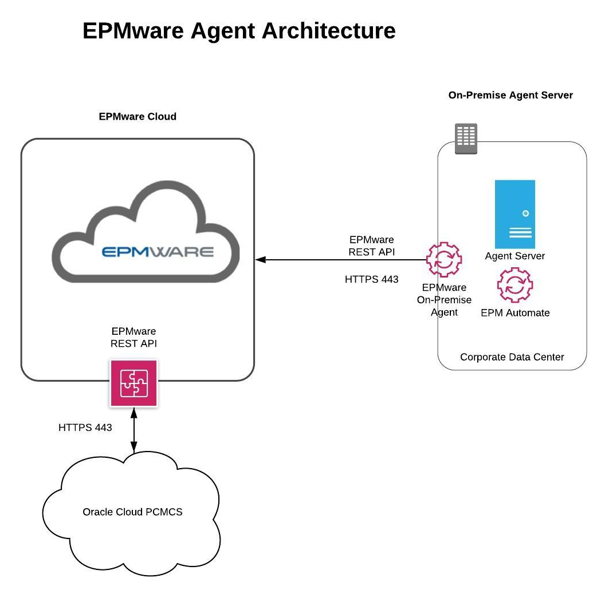

# PCMCS

There are two options to connect to PCMCS applications using the EPMware Agent. The
EPMware agent can either be installed on the EPMware supplied cloud server on AWS
or on a customer supplied server. If an EPMWARE supplied cloud server is used then no
action is required. However, it is possible that Oracle may either block communication
initiated from the AWS server and therefore customers may choose to use their own
server to communicate with the PCMCS application.

  

