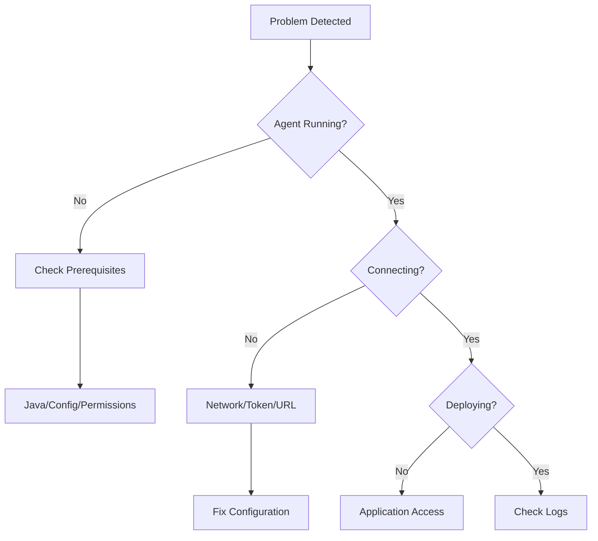

# Appendices

This section contains reference materials, quick guides, and supplementary information for the EPMware Agent.

## Reference Materials

<div class="grid cards" markdown>

- :material-lan-connect: **[Appendix A - Port Requirements](ports.md)**  
  Network ports and firewall configuration reference
  
- :material-shield-lock: **[Appendix B - Security Checklist](security.md)**  
  Comprehensive security configuration checklist
  
- :material-console-line: **[Appendix C - Agent Commands](commands.md)**  
  Complete command reference for agent operations
  
- :material-alert-circle: **[Appendix D - Error Codes](error-codes.md)**  
  Error code reference and resolution guide

</div>

## Quick Reference Guides

### File Locations

Common file paths for reference:

#### Windows Paths
```
Installation: C:\cygwin64\home\[username]\
Configuration: C:\cygwin64\home\[username]\agent.properties
Logs: C:\cygwin64\home\[username]\logs\
Service Script: C:\cygwin64\home\[username]\ew_target_service.sh
```

#### Linux Paths
```
Installation: /home/[username]/
Configuration: /home/[username]/agent.properties
Logs: /home/[username]/logs/
Service Script: /home/[username]/ew_target_service.sh
Systemd Service: /etc/systemd/system/epmware-agent.service
```

### Configuration Parameters

Essential configuration parameters:

| Parameter | Description | Example |
|-----------|-------------|---------|
| `ew.portal.server` | EPMware server name | `epmware1.company.com` |
| `ew.portal.url` | EPMware URL | `https://epmware.company.com` |
| `ew.portal.token` | REST API token | `UUID-format-token` |
| `agent.interval.millisecond` | Polling interval | `30000` |
| `agent.root.dir` | Agent directory | `/home/epmadmin` |

### Common Commands

Frequently used commands:

#### Start/Stop Operations
```bash
# Start agent
./ew_target_service.sh

# Stop agent
pkill -f epmware-agent

# Check status
ps aux | grep epmware-agent

# View logs
tail -f logs/agent.log
```

#### Testing and Validation
```bash
# Test connection
java -jar epmware-agent.jar --test

# Validate configuration
java -jar epmware-agent.jar --validate-config

# Check version
java -jar epmware-agent.jar --version
```

### Network Requirements

Standard port requirements:

| Direction | Port | Protocol | Purpose |
|-----------|------|----------|---------|
| Outbound | 443 | HTTPS | EPMware Cloud |
| Outbound | 8080 | HTTP | EPMware On-Premise |
| Outbound | 19000 | TCP | HFM |
| Outbound | 19000 | TCP | Planning |
| Outbound | 1423 | TCP | Essbase |

### System Requirements Summary

Minimum requirements checklist:

- [ ] **CPU**: 2+ cores x64
- [ ] **Memory**: 16 GB RAM
- [ ] **Storage**: 60 GB available
- [ ] **Java**: Version 1.8+
- [ ] **Network**: 10 Mbps+
- [ ] **OS**: Supported version

### Security Requirements

Security configuration checklist:

- [ ] Dedicated service account
- [ ] Restricted file permissions
- [ ] Encrypted password files
- [ ] Regular token rotation
- [ ] Firewall rules configured
- [ ] Audit logging enabled

## Environment Variables

Commonly used environment variables:

```bash
# Java Configuration
JAVA_HOME=/usr/java/latest
PATH=$JAVA_HOME/bin:$PATH

# Agent Configuration
EPMWARE_HOME=/home/epmadmin
EPMWARE_TOKEN=your-token-here
EPMWARE_ENV=production

# Proxy Configuration (if needed)
HTTP_PROXY=http://proxy:8080
HTTPS_PROXY=http://proxy:8080
NO_PROXY=localhost,127.0.0.1
```

## Log File Reference

Understanding log entries:

### Log Levels
| Level | Description | Example |
|-------|-------------|---------|
| `TRACE` | Detailed debug info | Method entry/exit |
| `DEBUG` | Debug information | Variable values |
| `INFO` | Normal operations | Deployment started |
| `WARN` | Warning conditions | Retry attempt |
| `ERROR` | Error conditions | Connection failed |
| `FATAL` | Fatal errors | Agent crash |

### Log File Rotation
```properties
# Default rotation settings
log.file.max-size=10MB
log.file.max-history=30
log.file.total-size-cap=1GB
```

## Troubleshooting Quick Reference

### Problem Diagnosis Flow


### Critical Files to Check
1. `agent.properties` - Configuration
2. `agent.log` - Main activity log
3. `agent-poll.log` - Polling activity
4. `ew_target_service.sh` - Service script

## Performance Tuning Reference

### JVM Settings
```bash
# Memory Settings
-Xms1024m          # Initial heap
-Xmx2048m          # Maximum heap
-XX:MaxMetaspaceSize=256m

# Garbage Collection
-XX:+UseG1GC
-XX:MaxGCPauseMillis=200
-XX:G1HeapRegionSize=8m

# Debugging
-XX:+HeapDumpOnOutOfMemoryError
-XX:HeapDumpPath=/var/log/epmware
```

### System Tuning
```bash
# File Descriptors
ulimit -n 65536

# Process Limits
ulimit -u 32768

# Network Tuning
sysctl -w net.core.rmem_max=134217728
sysctl -w net.core.wmem_max=134217728
```

## Maintenance Schedule Template

Suggested maintenance activities:

### Daily
- [ ] Check agent status
- [ ] Review error logs
- [ ] Monitor deployments
- [ ] Verify polling activity

### Weekly
- [ ] Archive old logs
- [ ] Clean temp files
- [ ] Review performance metrics
- [ ] Test connectivity

### Monthly
- [ ] Rotate credentials
- [ ] Update documentation
- [ ] Review security settings
- [ ] Capacity planning

### Quarterly
- [ ] Agent updates
- [ ] Security audit
- [ ] Performance review
- [ ] DR testing

## Support Information

### Collecting Diagnostic Information

When contacting support, gather:

```bash
# System information
uname -a > diagnostics.txt
java -version >> diagnostics.txt
df -h >> diagnostics.txt
free -h >> diagnostics.txt

# Agent information
cat agent.properties | grep -v token >> diagnostics.txt
tail -1000 logs/agent.log >> diagnostics.txt
ps aux | grep epmware >> diagnostics.txt

# Network information
netstat -an | grep ESTABLISHED >> diagnostics.txt
```

### Support Contact Information

**EPMware Support**
- Email: support@epmware.com
- Phone: 408-614-0442
- Portal: support.epmware.com
- Hours: Monday-Friday, 8 AM - 6 PM PST

### Version Information

Track version details:

```bash
# Agent version
java -jar epmware-agent.jar --version

# Java version
java -version

# OS version
cat /etc/os-release  # Linux
ver  # Windows
```

## Glossary

Common terms and acronyms:

| Term | Definition |
|------|------------|
| **Agent** | EPMware on-premise component |
| **EPM** | Enterprise Performance Management |
| **HFM** | Hyperion Financial Management |
| **PCMCS** | Profitability and Cost Management Cloud Service |
| **REST** | Representational State Transfer |
| **Token** | Authentication credential |
| **UUID** | Universally Unique Identifier |

## Useful Scripts

### Backup Script
```bash
#!/bin/bash
# backup_agent.sh
BACKUP_DIR="/backup/epmware/$(date +%Y%m%d)"
mkdir -p $BACKUP_DIR
cp agent.properties $BACKUP_DIR/
cp ew_target_service.sh $BACKUP_DIR/
tar -czf $BACKUP_DIR.tar.gz $BACKUP_DIR
```

### Health Check Script
```bash
#!/bin/bash
# health_check.sh
if pgrep -f epmware-agent > /dev/null; then
    echo "✓ Agent running"
else
    echo "✗ Agent not running"
fi
```

### Log Cleanup Script
```bash
#!/bin/bash
# cleanup_logs.sh
find logs/ -name "*.log" -mtime +30 -delete
find logs/ -name "*.gz" -mtime +90 -delete
find temp/ -type f -mtime +7 -delete
```

## Change Log Template

Document configuration changes:

```markdown
## Change Log

### 2023-11-15
- **Change**: Updated polling interval to 30 seconds
- **Reason**: Improve deployment responsiveness
- **By**: Admin Name
- **Tested**: Yes, in development

### 2023-11-01
- **Change**: Generated new REST token
- **Reason**: Quarterly rotation
- **By**: Admin Name
- **Tested**: Yes, connection verified
```

## Compliance and Audit

### Audit Requirements

Track for compliance:

1. **Access Logs** - Who accessed the agent
2. **Configuration Changes** - What was changed
3. **Deployment History** - What was deployed
4. **Error Logs** - What failed
5. **Token Usage** - Authentication events

### Compliance Checklist

- [ ] Passwords encrypted
- [ ] Tokens rotated regularly
- [ ] Audit logs retained
- [ ] Access controls implemented
- [ ] Security patches applied
- [ ] Documentation current

!!! note "Living Document"
    These appendices are living documents that should be updated as your environment changes. Regular reviews ensure accuracy and usefulness.

!!! tip "Quick Access"
    Bookmark these appendices for quick reference during operations and troubleshooting.

## Next Steps

Explore specific appendices:

1. [Port Requirements](ports.md) - Network configuration
2. [Security Checklist](security.md) - Security hardening
3. [Agent Commands](commands.md) - Command reference
4. [Error Codes](error-codes.md) - Error resolution