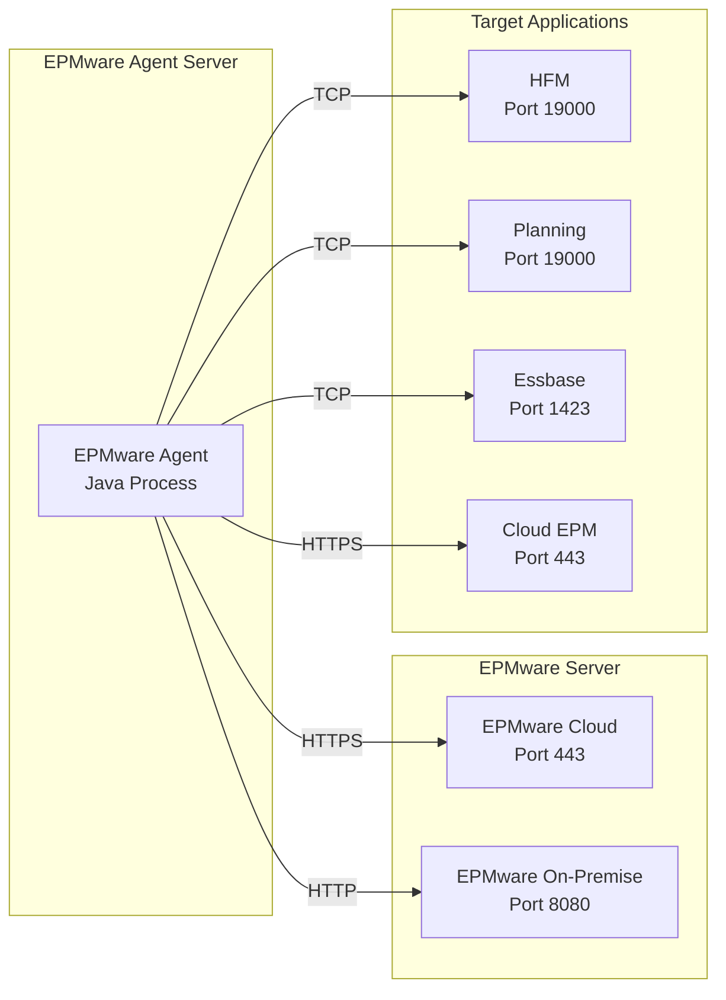

# Appendix A - Port Requirements

This appendix provides a comprehensive reference for all network ports used by the EPMware Agent and integrated applications.

## Port Overview Diagram



## Standard Port Requirements

### EPMware Communication Ports

| Port | Protocol | Direction | Service | Description | Required |
|------|----------|-----------|---------|-------------|----------|
| **443** | HTTPS/TCP | Outbound | EPMware Cloud | Secure communication to cloud instance | Yes (Cloud) |
| **8080** | HTTP/TCP | Outbound | EPMware On-Premise | Default on-premise port | Yes (On-Premise) |
| **8443** | HTTPS/TCP | Outbound | EPMware On-Premise SSL | Secure on-premise alternative | Optional |

### Application-Specific Ports

#### Hyperion HFM

| Port | Protocol | Direction | Description | Notes |
|------|----------|-----------|-------------|-------|
| **19000** | TCP | Outbound | HFM Application Server | Default HFM port |
| **80** | HTTP | Outbound | HFM Web Server | Web interface |
| **443** | HTTPS | Outbound | HFM Web Server SSL | Secure web interface |
| **1433** | TCP | Outbound | SQL Server | HFM database (if SQL Server) |
| **1521** | TCP | Outbound | Oracle DB | HFM database (if Oracle) |

#### Hyperion Planning

| Port | Protocol | Direction | Description | Notes |
|------|----------|-----------|-------------|-------|
| **19000** | TCP | Outbound | Planning RMI Registry | Default Planning port |
| **8300** | HTTP | Outbound | Planning Web Server | Web application |
| **8343** | HTTPS | Outbound | Planning Web Server SSL | Secure web application |
| **1423** | TCP | Outbound | Essbase Server | For Planning/Essbase integration |

#### Essbase

| Port | Protocol | Direction | Description | Notes |
|------|----------|-----------|-------------|-------|
| **1423** | TCP | Outbound | Essbase Agent | Primary Essbase port |
| **32768-33768** | TCP | Outbound | Essbase Apps | Application port range |
| **6711** | TCP | Outbound | Essbase Provider Services | APS communication |
| **9443** | HTTPS | Outbound | Essbase Web | Web interface |

#### Oracle Cloud EPM

| Port | Protocol | Direction | Description | Notes |
|------|----------|-----------|-------------|-------|
| **443** | HTTPS | Outbound | Cloud Services | All cloud communication |
| **22** | SSH | Outbound | SFTP | File transfer (optional) |

### Infrastructure Ports

| Port | Protocol | Direction | Service | Description |
|------|----------|-----------|---------|-------------|
| **53** | UDP/TCP | Outbound | DNS | Domain name resolution |
| **123** | UDP | Outbound | NTP | Time synchronization |
| **389** | TCP | Outbound | LDAP | Directory services |
| **636** | TCP | Outbound | LDAPS | Secure LDAP |
| **3128** | TCP | Outbound | Proxy | Corporate proxy (common) |
| **8080** | TCP | Outbound | Proxy | Alternative proxy port |

## Port Configuration by Environment

### Development Environment

```yaml
# Minimal port requirements for development
Outbound Ports Required:
  - 443  (EPMware Cloud)
  - 8080 (EPMware On-Premise)
  - Target application ports as needed
```

### Production Environment

```yaml
# Full port requirements for production
Outbound Ports Required:
  - 443  (HTTPS - EPMware and Cloud EPM)
  - 19000 (HFM/Planning)
  - 1423 (Essbase)
  - 53   (DNS)
  - 123  (NTP)
  
Optional Ports:
  - 389/636 (LDAP/LDAPS)
  - 3128/8080 (Proxy)
  - Database ports as required
```

## Firewall Configuration Examples

### Linux iptables

```bash
#!/bin/bash
# iptables configuration for EPMware Agent

# EPMware Cloud
iptables -A OUTPUT -p tcp --dport 443 -d epmware-cloud.com -j ACCEPT

# HFM
iptables -A OUTPUT -p tcp --dport 19000 -d hfm-server.local -j ACCEPT

# Planning
iptables -A OUTPUT -p tcp --dport 19000 -d planning-server.local -j ACCEPT

# Essbase
iptables -A OUTPUT -p tcp --dport 1423 -d essbase-server.local -j ACCEPT

# DNS
iptables -A OUTPUT -p udp --dport 53 -j ACCEPT
iptables -A OUTPUT -p tcp --dport 53 -j ACCEPT

# Save configuration
iptables-save > /etc/iptables/rules.v4
```

### Linux firewalld

```bash
# firewalld configuration
firewall-cmd --permanent --zone=public --add-port=443/tcp
firewall-cmd --permanent --zone=public --add-port=19000/tcp
firewall-cmd --permanent --zone=public --add-port=1423/tcp
firewall-cmd --permanent --zone=public --add-port=53/udp
firewall-cmd --permanent --zone=public --add-port=53/tcp
firewall-cmd --reload
```

### Windows Firewall

```powershell
# PowerShell firewall rules

# EPMware Cloud
New-NetFirewallRule -DisplayName "EPMware Cloud HTTPS" `
    -Direction Outbound -Protocol TCP -RemotePort 443 `
    -RemoteAddress "epmware-cloud.com" -Action Allow

# HFM
New-NetFirewallRule -DisplayName "HFM Application" `
    -Direction Outbound -Protocol TCP -RemotePort 19000 `
    -RemoteAddress "192.168.1.0/24" -Action Allow

# Planning
New-NetFirewallRule -DisplayName "Planning Application" `
    -Direction Outbound -Protocol TCP -RemotePort 19000 `
    -RemoteAddress "192.168.1.0/24" -Action Allow

# Essbase
New-NetFirewallRule -DisplayName "Essbase" `
    -Direction Outbound -Protocol TCP -RemotePort 1423 `
    -RemoteAddress "192.168.1.0/24" -Action Allow
```

## Port Testing Commands

### Basic Connectivity Tests

```bash
# Test specific port
telnet server.com 443
nc -zv server.com 443

# Test multiple ports
for port in 443 8080 19000 1423; do
    echo "Testing port $port..."
    nc -zv server.com $port
done

# PowerShell test
Test-NetConnection -ComputerName server.com -Port 443
```

### Comprehensive Port Scanner

```bash
#!/bin/bash
# port_scanner.sh - Test all required ports

declare -A PORTS=(
    ["EPMware Cloud"]=443
    ["EPMware On-Premise"]=8080
    ["HFM"]=19000
    ["Planning"]=19000
    ["Essbase"]=1423
    ["DNS"]=53
)

for service in "${!PORTS[@]}"; do
    port=${PORTS[$service]}
    echo -n "Testing $service (port $port)... "
    
    if timeout 2 bash -c "cat < /dev/null > /dev/tcp/localhost/$port" 2>/dev/null; then
        echo "✓ OPEN"
    else
        echo "✗ CLOSED or FILTERED"
    fi
done
```

## Network Segmentation

### DMZ Configuration

```
Internet <--> [Firewall] <--> DMZ <--> [Firewall] <--> Internal Network
                                |                            |
                          EPMware Agent              Target Applications
                          
Allowed: DMZ -> Internet (443)
Allowed: DMZ -> Internal (19000, 1423)
Blocked: Internet -> DMZ (all inbound)
```

### VLAN Segmentation

```yaml
VLAN 100 - Management:
  - EPMware Agent Servers
  - Allowed Ports: All required outbound

VLAN 200 - Application:
  - HFM, Planning, Essbase Servers
  - Allowed Ports: Application specific

VLAN 300 - Database:
  - Oracle, SQL Server
  - Allowed Ports: Database specific
```

## Proxy Configuration

### Proxy Ports

| Port | Protocol | Common Use | Configuration |
|------|----------|------------|---------------|
| **3128** | HTTP/HTTPS | Squid default | Most common proxy port |
| **8080** | HTTP/HTTPS | Alternative | Common alternative |
| **8888** | HTTP/HTTPS | Debugging | Often used for debugging proxies |
| **1080** | SOCKS | SOCKS proxy | For SOCKS protocol |

### Proxy Bypass Configuration

```properties
# agent.properties
http.proxyHost=proxy.company.com
http.proxyPort=3128
https.proxyHost=proxy.company.com
https.proxyPort=3128

# Bypass internal servers
http.nonProxyHosts=localhost|127.0.0.1|*.internal.com|192.168.*
```

## Port Security Best Practices

### Minimize Attack Surface

1. **Only open required ports** - Don't open ranges unnecessarily
2. **Use specific destinations** - Restrict by IP when possible
3. **Implement egress filtering** - Control outbound traffic
4. **Regular port audits** - Review and close unused ports

### Port Security Checklist

- [ ] Document all open ports
- [ ] Justify each port requirement
- [ ] Restrict by source/destination IP
- [ ] Use encrypted protocols (HTTPS over HTTP)
- [ ] Monitor port usage
- [ ] Regular security scans
- [ ] Close unused ports immediately

### Security Scanning

```bash
# Scan for open ports (requires nmap)
nmap -p 1-65535 localhost

# Check listening ports
netstat -tulpn | grep LISTEN  # Linux
netstat -an | findstr LISTEN   # Windows

# Check established connections
netstat -an | grep ESTABLISHED
```

## Troubleshooting Port Issues

### Common Port Problems

| Problem | Symptom | Solution |
|---------|---------|----------|
| Port blocked by firewall | Connection timeout | Open port in firewall |
| Port already in use | Bind error | Find and stop conflicting process |
| Wrong port configured | Connection refused | Verify configuration |
| Port filtered by network | No response | Contact network team |

### Diagnostic Commands

```bash
# Find what's using a port
lsof -i :443              # Linux
netstat -ano | findstr 443  # Windows

# Check if port is open
nc -l 1234 &              # Start listener
nc localhost 1234         # Test connection

# Packet capture
tcpdump -i any port 443  # Linux
```

## Port Requirements by Deployment Model

### Cloud-Only Deployment

```yaml
Minimum Ports:
  - 443 (HTTPS to EPMware Cloud)
  - 443 (HTTPS to Oracle Cloud EPM)
  - 53  (DNS)
  
Total: 2 unique ports
```

### On-Premise Only Deployment

```yaml
Minimum Ports:
  - 8080 (EPMware On-Premise)
  - 19000 (HFM/Planning)
  - 1423 (Essbase)
  - Database ports
  
Total: 4-5 unique ports
```

### Hybrid Deployment

```yaml
All Ports:
  - 443 (Cloud services)
  - 8080 (On-premise EPMware)
  - 19000 (HFM/Planning)
  - 1423 (Essbase)
  - Database ports
  - Infrastructure ports
  
Total: 6-10 unique ports
```

## High Availability Considerations

### Load Balancer Ports

| Port | Protocol | Purpose |
|------|----------|---------|
| **80** | HTTP | Load balancer frontend |
| **443** | HTTPS | Secure load balancer frontend |
| **8080** | HTTP | Backend health checks |
| **9000** | TCP | Load balancer administration |

### Cluster Communication

```yaml
Cluster Ports (if applicable):
  - 7000-7001: Cluster communication
  - 9160: Cluster gossip
  - 5701: Hazelcast clustering
```

## Compliance and Audit

### Port Documentation Template

```markdown
| Port | Protocol | Direction | Purpose | Approved By | Date | Review Date |
|------|----------|-----------|---------|-------------|------|-------------|
| 443  | HTTPS    | Outbound  | EPMware | Security Team | 2023-11-01 | 2024-11-01 |
```

### Audit Commands

```bash
#!/bin/bash
# port_audit.sh - Generate port audit report

echo "=== Port Audit Report ==="
echo "Date: $(date)"
echo "Server: $(hostname)"
echo ""
echo "=== Open Ports ==="
netstat -tulpn | grep LISTEN
echo ""
echo "=== Established Connections ==="
netstat -an | grep ESTABLISHED | head -20
echo ""
echo "=== Firewall Rules ==="
iptables -L -n -v
```

!!! warning "Security Note"
    Never open ports that aren't absolutely necessary. Each open port increases your attack surface and should be justified, documented, and regularly reviewed.

!!! tip "Port Testing"
    Always test port connectivity after firewall changes using multiple methods (telnet, nc, nmap) to ensure rules are working as expected.

## Next Steps

- [Security Checklist](security.md) - Security configuration
- [Agent Commands](commands.md) - Command reference
- [Error Codes](error-codes.md) - Error resolution
- [Return to Appendices](index.md) - Main appendices page