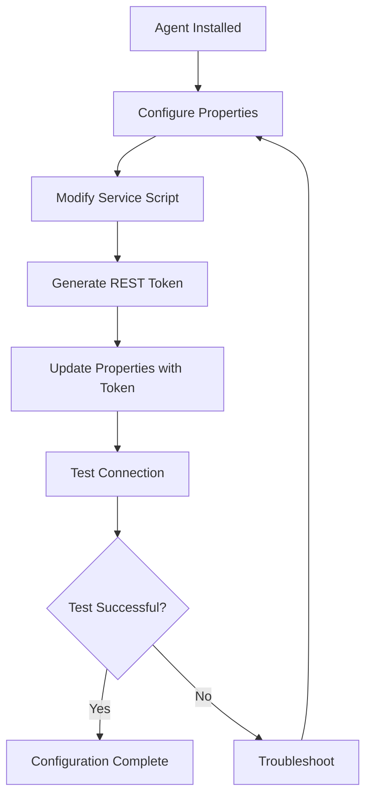

# Configuration Overview

The configuration phase is critical for establishing secure and reliable communication between the EPMware Agent and your EPMware instance. This section guides you through all aspects of agent configuration.

## Configuration Components

<div class="grid cards" markdown>

- :material-file-cog: **[Agent Properties](agent-properties.md)**  
  Core configuration file containing connection settings, tokens, and paths
  
- :material-script-text: **[Service Configuration](service-config.md)**  
  Service script setup for starting and managing the agent
  
- :material-key-variant: **[REST API Token](rest-token.md)**  
  Authentication token generation and management
  
- :material-lan-connect: **[Testing Connection](testing.md)**  
  Verify agent connectivity and troubleshoot issues

</div>

## Configuration Workflow

The typical configuration process follows these steps:



## Quick Configuration Guide

### Step 1: Basic Properties Setup

Edit `agent.properties` with essential settings:

```properties
# Minimal configuration
ew.portal.server=your-server-name
ew.portal.url=https://your-instance.epmwarecloud.com
ew.portal.token=your-rest-token-here
agent.interval.millisecond=30000
agent.root.dir=/home/your-user
```

### Step 2: Service Script Adjustment

Update `ew_target_service.sh` with correct path:

```bash
#!/bin/bash
HOME=/home/your-user  # Update this line
cd $HOME
java -jar epmware-agent.jar --spring.config.name=agent
```

### Step 3: Token Configuration

1. Generate token in EPMware UI
2. Copy token value
3. Update `agent.properties`
4. Secure the configuration file

### Step 4: Connection Test

```bash
# Quick test
./ew_target_service.sh

# Verify polling
tail -f logs/agent-poll.log
```

## Configuration Files Reference

### Primary Configuration Files

| File | Purpose | Location |
|------|---------|----------|
| `agent.properties` | Main configuration | Agent home directory |
| `ew_target_service.sh` | Service startup script | Agent home directory |
| `application.yml` | Spring Boot config (optional) | `config/` directory |
| `logback.xml` | Logging config (optional) | `config/` directory |

### Configuration Hierarchy

Configuration values are loaded in this order (later overrides earlier):

1. Default values in JAR
2. `agent.properties` file
3. Environment variables
4. Command line arguments

## Environment-Specific Configurations

### Development Environment

Optimized for debugging and testing:

```properties
# Development settings
ew.portal.url=https://dev.epmwarecloud.com
agent.interval.millisecond=60000  # Less frequent polling
agent.log.level=DEBUG
agent.test.mode=true
```

### Production Environment

Optimized for reliability and performance:

```properties
# Production settings
ew.portal.url=https://prod.epmwarecloud.com
agent.interval.millisecond=30000
agent.log.level=INFO
agent.retry.count=3
agent.timeout.seconds=3600
```

## Security Configuration

### Protecting Sensitive Data

1. **File Permissions**
   ```bash
   chmod 600 agent.properties  # Owner read/write only
   chmod 750 ew_target_service.sh  # Owner all, group read/execute
   ```

2. **Token Security**
   - Never commit tokens to version control
   - Use environment variables for tokens
   - Rotate tokens regularly

3. **Encrypted Properties**
   ```properties
   # Use encrypted values
   ew.portal.token={encrypted}AES256:...
   ```

### Network Security

Configure secure communication:

```properties
# TLS/SSL settings
agent.ssl.enabled=true
agent.ssl.verify-hostname=true
agent.ssl.trust-all=false
agent.ssl.protocol=TLSv1.2
```

## Advanced Configuration Topics

### High Availability Setup

Configure for redundancy:

```properties
# HA configuration
agent.ha.enabled=true
agent.ha.heartbeat.interval=5000
agent.ha.failover.timeout=30000
```

### Performance Tuning

Optimize for your environment:

```properties
# Performance settings
agent.thread.pool.size=10
agent.connection.pool.size=5
agent.batch.size=100
agent.compression.enabled=true
```

### Monitoring Configuration

Enable monitoring endpoints:

```properties
# Monitoring
management.endpoints.enabled=true
management.endpoint.health.enabled=true
management.endpoint.metrics.enabled=true
management.server.port=8081
```

## Configuration Validation

### Pre-Flight Checklist

Before starting the agent:

- [ ] Server name matches EPMware configuration
- [ ] URL is correct and accessible
- [ ] Token is valid and properly formatted
- [ ] Paths use correct format for OS
- [ ] Service script has correct HOME directory
- [ ] Java is accessible and correct version
- [ ] Network connectivity is established
- [ ] File permissions are properly set

### Configuration Testing

Test each component:

1. **Properties Validation**
   ```bash
   # Check syntax
   grep -E "^[^#].*=" agent.properties
   ```

2. **Token Validation**
   ```bash
   # Test token
   curl -H "Authorization: Bearer YOUR-TOKEN" \
        https://your-server.com/api/v1/auth/verify
   ```

3. **Service Script Test**
   ```bash
   # Test script
   bash -n ew_target_service.sh  # Syntax check
   ./ew_target_service.sh  # Execution test
   ```

## Common Configuration Patterns

### Multi-Application Setup

Supporting multiple applications:

```properties
# Application-specific settings
hfm.enabled=true
hfm.server=hfm-server.com
planning.enabled=true
planning.server=planning-server.com
```

### Proxy Configuration

For environments with proxy servers:

```properties
# Proxy settings
http.proxyHost=proxy.company.com
http.proxyPort=8080
https.proxyHost=proxy.company.com
https.proxyPort=8080
http.nonProxyHosts=localhost|127.0.0.1
```

### Custom Scripts Integration

Integrating with existing scripts:

```properties
# Custom script hooks
agent.script.pre-deploy=/opt/scripts/pre-deploy.sh
agent.script.post-deploy=/opt/scripts/post-deploy.sh
agent.script.on-error=/opt/scripts/error-handler.sh
```

## Troubleshooting Configuration

### Common Issues

| Issue | Likely Cause | Solution |
|-------|-------------|----------|
| Agent won't start | Invalid configuration | Check syntax and required fields |
| Connection failed | Wrong URL or token | Verify server URL and regenerate token |
| Permission denied | File permissions | Fix ownership and permissions |
| Path not found | Incorrect directory | Update paths in configuration |

### Debug Mode

Enable comprehensive debugging:

```properties
# Debug configuration
agent.debug=true
agent.log.level=TRACE
agent.log.verbose=true
agent.log.include-stacktrace=true
```

### Configuration Backup

Always backup before changes:

```bash
# Backup configuration
cp agent.properties agent.properties.backup.$(date +%Y%m%d)
cp ew_target_service.sh ew_target_service.sh.backup.$(date +%Y%m%d)

# Restore if needed
cp agent.properties.backup.20231115 agent.properties
```

## Best Practices

### Configuration Management

1. **Version Control** - Track configuration changes
2. **Documentation** - Document all customizations
3. **Validation** - Test changes before production
4. **Standardization** - Use consistent naming conventions

### Security Guidelines

1. **Least Privilege** - Grant minimum required permissions
2. **Encryption** - Encrypt sensitive values
3. **Rotation** - Regular token and password rotation
4. **Auditing** - Log configuration changes

### Maintenance Tips

1. **Regular Reviews** - Audit configurations quarterly
2. **Update Tracking** - Document version updates
3. **Performance Monitoring** - Track configuration impact
4. **Disaster Recovery** - Maintain configuration backups

## Getting Help

If you encounter configuration issues:

1. Check the [Troubleshooting Guide](../troubleshooting/index.md)
2. Review agent logs for specific errors
3. Verify all prerequisites are met
4. Contact EPMware Support with:
   - Configuration files (sanitized)
   - Error messages
   - Log excerpts

!!! tip "Configuration Templates"
    EPMware provides configuration templates for common scenarios. Contact support for templates matching your environment.

!!! warning "Production Changes"
    Always test configuration changes in a non-production environment first. Have a rollback plan ready before making production changes.

## Next Steps

After completing configuration:

1. [Test the Connection](testing.md) - Verify everything works
2. [Schedule the Agent](../management/windows/scheduled-tasks.md) - Set up automatic startup
3. [Configure Applications](../integration/index.md) - Set up target integrations
4. [Monitor Operations](../management/monitoring.md) - Implement monitoring