# EPMWare On-Premise Agent Configuration


## Prerequisites

- Java (JRE or JDK) should be installed or available on the On-Premise Server.
- Java version should be 1.8 OR above.
- Ensure java location is in the system path.
- Ensure zip location is in the system path.
- Ensure the firewall port is open to communicate to the EPMWARE application. If you are using EPMWARE on cloud then port 443 needs to be opened up. If you
are using EPMWARE on-premise then whatever port Apache is listening to (such
as 8080) needs to be opened up.


## Check Pre-requisites

- Log on to Cygwin terminal
- Enter java -version on command line. See example below

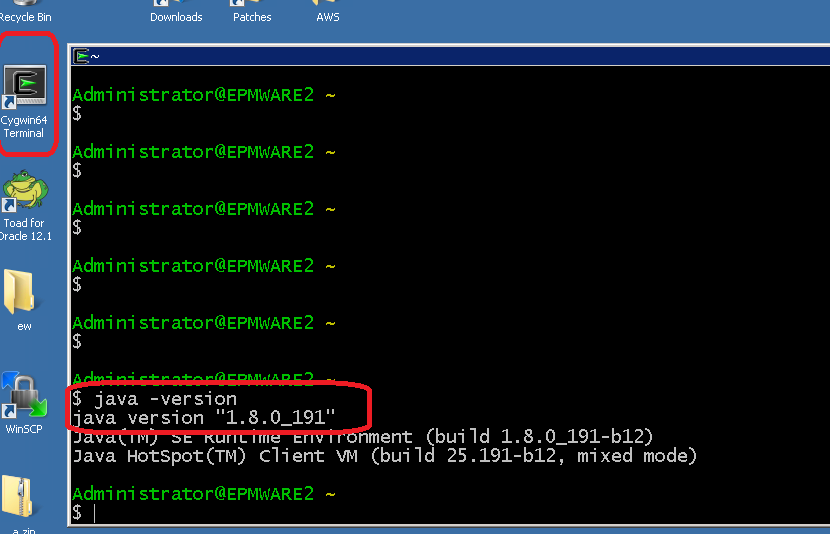<br/>

- Check zip is in path or not by entering “zip -v” (or simply zip) on the command prompt.

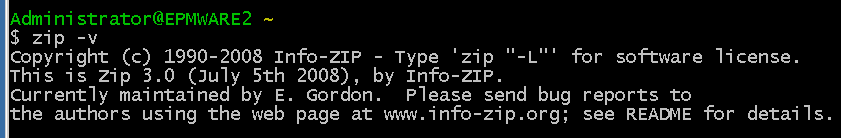<br/>


## Agent Service File

Modify the `“ew_target_service.sh”` file to update the path of the CYGWIN User as
shown below

(By default path is configured for Administrator user).

**Original content of this file**

```
#mvn spring-boot:run
HOME=/home/Administrator
cd $HOME
#java -jar epmware-agent.jar --spring.config.name=agent > /dev/null 2>&1
java -jar epmware-agent.jar --spring.config.name=agent


If the CYGWIN user is not Administrator (for example, hfmsvcaccount) then
change the HOME path as shown below.

#mvn spring-boot:run
HOME=/home/hfmsvcaccount
cd $HOME
#java -jar epmware-agent.jar --spring.config.name=agent > /dev/null 2>&1
java -jar epmware-agent.jar --spring.config.name=agent

```


## Agent Properties

Modify the `agent.properties` file located where the agent files are installed as shown below.

> **Note:** This step needs to be performed on each on-premise server that will directly integrate with EPMware.

**File Contents (as an example)**


**On-Premise version of EPMWARE example**

```
ew.portal.server=epmware1.epmware.com
ew.portal.url=http://epmware_server.com:8080/epmware
ew.portal.token=2e6d4103-5145-4c30-9837-ac6d14797523
agent.interval.millisecond=30000
agent.root.dir=C:\\cygwin64\\home\\Administrator

```

**Cloud version of EPMWARE example**

```
ew.portal.server=epmware1.epmware.com
ew.portal.url=http://client.epmwarecloud.com
ew.portal.token=2e6d4103-5145-4c30-9837-ac6d14797523
agent.interval.millisecond=30000
agent.root.dir=C:\\cygwin64\\home\\Administrator
```


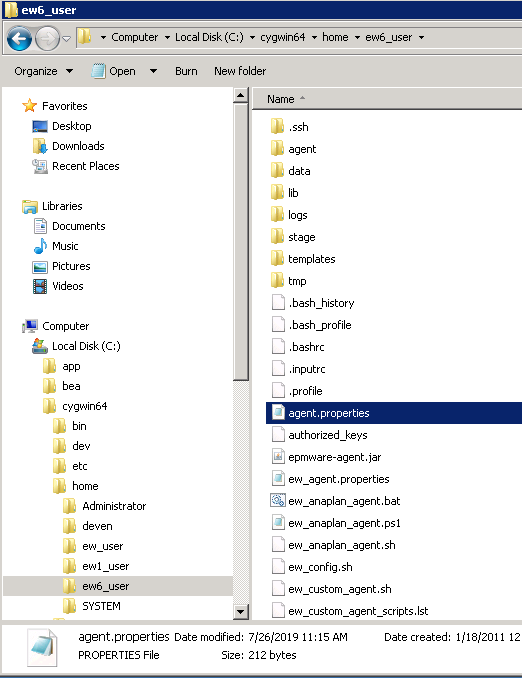<br/>

## agent.properties Configuration

| Name                     | Description                                                                 | Comments / Example                                                                 |
|--------------------------|------------------------------------------------------------------------------|-------------------------------------------------------------------------------------|
| `ew.portal.server`       | “Server Name” configured in EPMware for the target server                  | See screenshot below for example                                                   |
| `ew.portal.token`        | Generate Agent Token for the user that will be used to authenticate to EPMware | See screenshot below for example                                                   |
| `agent.interval.millisecond` | Polling interval in milliseconds                                           | 30 seconds is recommended value                                                    |
| `agent.root.dir`         | Directory name where agent is installed                                    | For Windows, it is the folder where Agent is installed                            |
| `agent.params.quote`     | Used only for enclosing agent parameter values. This character (only one character) is used to override default values of single quote character for Linux operating system target servers. For Windows Servers no need to specify this parameter as default value is setup automatically. | For Windows Servers, no need to set this parameter. For Linux servers specify “Double quote” character. |


**Server Name**

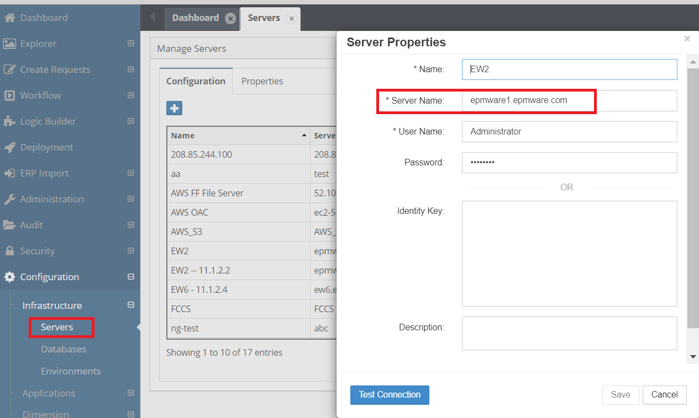<br/>


!!! info "NOTE : HFM Applications - reg.properties File Setup"

    The `reg.properties` file **must** be copied to the HFM application server.

    **Copy from Source Directory:**
    ```
    C:\Oracle\Middleware\user_projects\config\foundation\11.1.2.0
    ```

    **To Target Directory:**
    ```
    C:\Oracle\Middleware\user_projects\epmsystem1\config\foundation\11.1.2.0
    ```

    - Change the drive from `C:` to another directory if required.
    - `epmsystem1` represents the EPM Instance name.
    
    
## REST API Token

EPMWARE Agents on client’s on-premise servers uses REST APIs to perform tasks
such as Application Import, Deployment etc. EPMWARE agent uses a token (36
character long alpha-numeric value) to login to EPMWARE application using REST
protocol (Representational State Transfer). 

You can use any user and generate REST token for it and use this token during Agent Installation on the client’s on-premise servers.
Refer to EPMWARE Agent Installation guide for complete details for EPMWARE Agent
configurations. To generate token, select the user record and using right click mouse
button select “Generate Token” menu item.


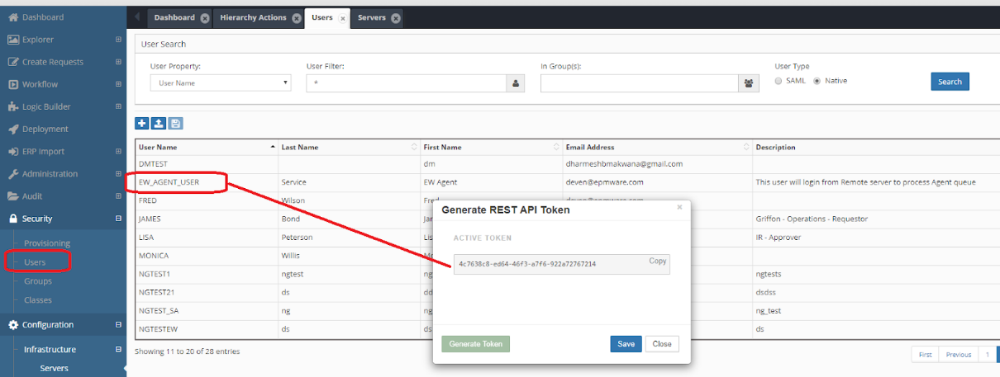<br/>


### Test Agent connectivity

From the Cygwin command agent can be executed to check if agents can communicate
with the EPMWARE application or not. 

Perform following steps to test the Agent connectivity. 

 **Note**: You can test the Agent Connection from the EPMWARE application
also from the `Infrastructure -> Servers page`. <br/>
Right click the server you want to test the
connection and click on the “Test Connection” button). If connection is alive then success
message will be returned in couple of minutes


1. Start cygwin terminal (ensure you have logged onto the Windows server as same
user under which EPMWARE agents are installed).
2. Execute service command `“./ew_target_service.sh”` as shown below.
3. If the connection is successful it will start polling. See second image below

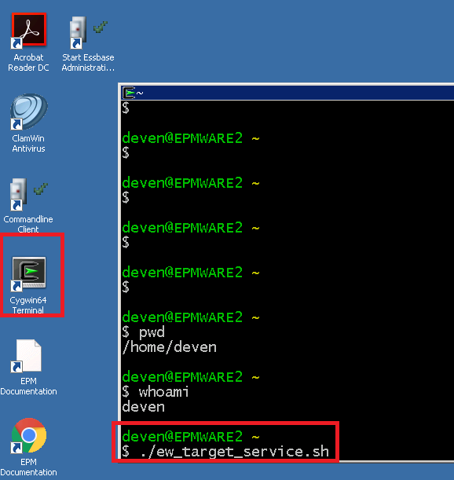<br/>

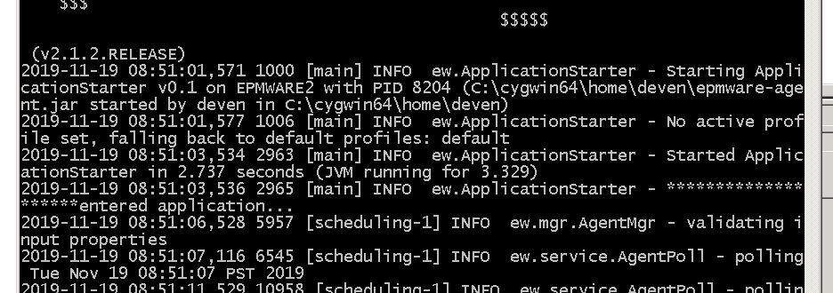<br/>


### Agent Troubleshooting
If you stop the Scheduled task, then java process related to the agent does not get
removed automatically. You must remove the java task before re-starting the agent if the
task is running. You can do that by either using Windows Task Manager and check java
process which is related to the agent (See process details. It will show you the path) and
terminate it. Alternatively, you can check java process at Cygwin terminal too as shown
below.

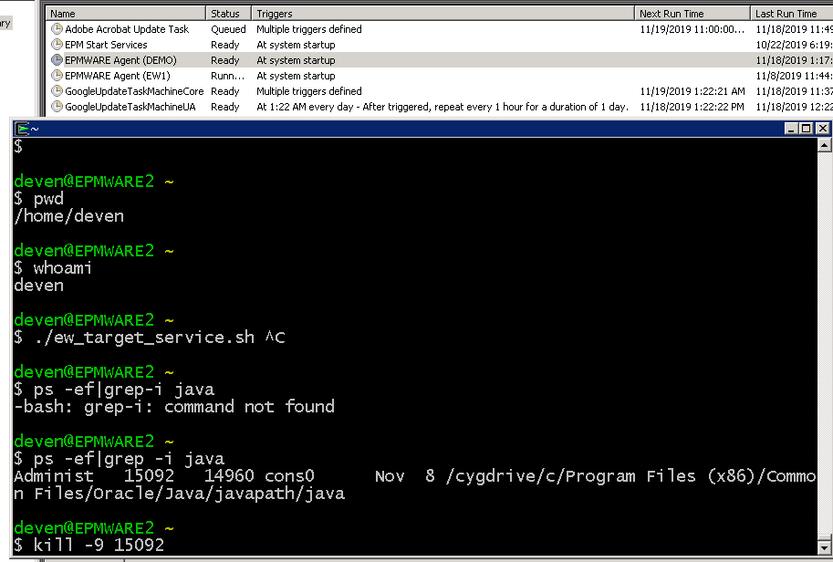<br/>

### Agent Logs
Agents will produce two log files under “logs” directory. “agent.log” file will show all agent
commands received from the EPMWARE application to be executed locally on the server
and the is the polling file which will show a line every interval set in the agent.properties
file.


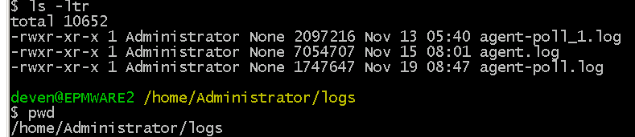<br/>

*Example of contents from agent.log*


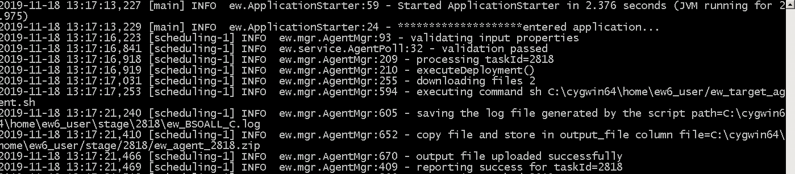<br/>

*Example of contents from agent-poll.log*

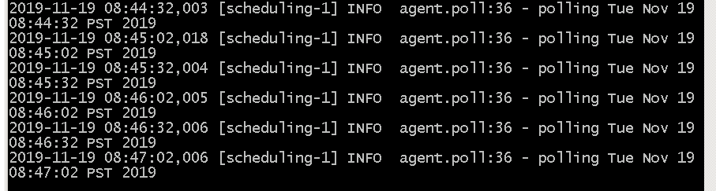<br/>


## Schedule Agent on Windows Servers

EPMWARE agents need to be continuously running on the Windows server and hence it
can be scheduled to run as a Windows scheduled task.

### Configuring agent as a Scheduled Task

Use the following steps to configure the EPMWARE agent to run as a Scheduled Task on
the Target Server. This step will allow the Agent to start automatically upon server restart.
Perform this task only if the Agent is not installed as a Windows Service already.

- Logon to the Windows server with Administrator privileges.
- Open Task Scheduler as shown below


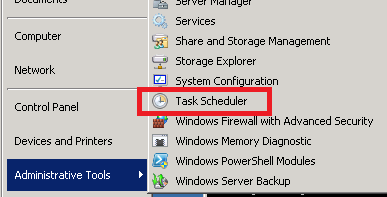<br/>

- Click on the ‘Create Task” under Actions menu on the right side.

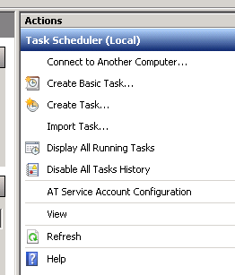<br/>

- Create new a Task called **EPMWARE TARGET AGENT SERVICE**

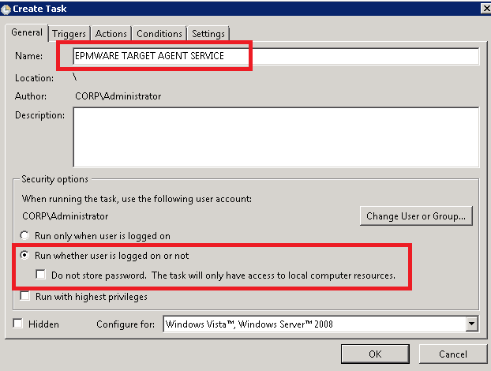<br/>

- Click on Triggers Tab. Click on New Button. This tab allows when to run the
scheduled Task. We will select upon Server Restart.

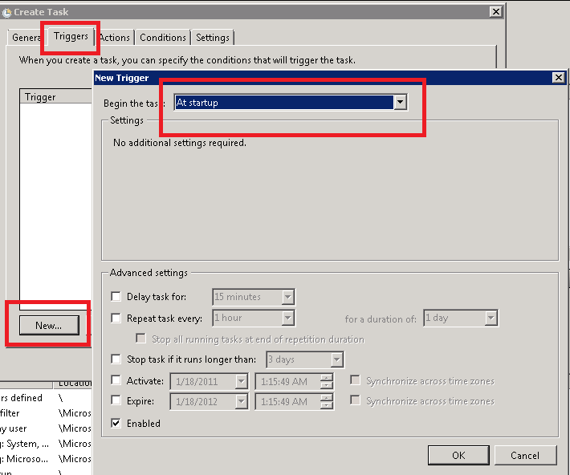<br/>


- Click on the “Actions” tab and enter the values shown below.

> Change the path of Cygwin if it is different from what is shown in the screenshot below.

| Field     | Value                              | Comments                          |
|-----------|------------------------------------|-----------------------------------|
| Action    | Start a Program                    |                                   |
| Script    | `C:\cygwin64\bin\bash.exe`         | Change Cygwin path if needed      |
| Arguments | `-l -c "./ew_target_service.sh"`   |                                   |
| Start in  | `C:\cygwin64\bin`                 | Change Cygwin path if needed      |


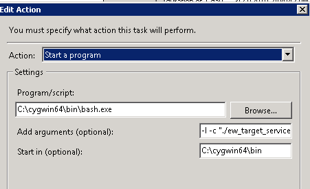<br/>

- Enter the username and password when prompted for that same user under
which Cygwin is installed and used for Target Agent.

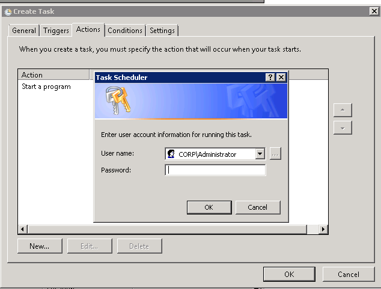<br/>

- Check new Scheduled Task as shown below.

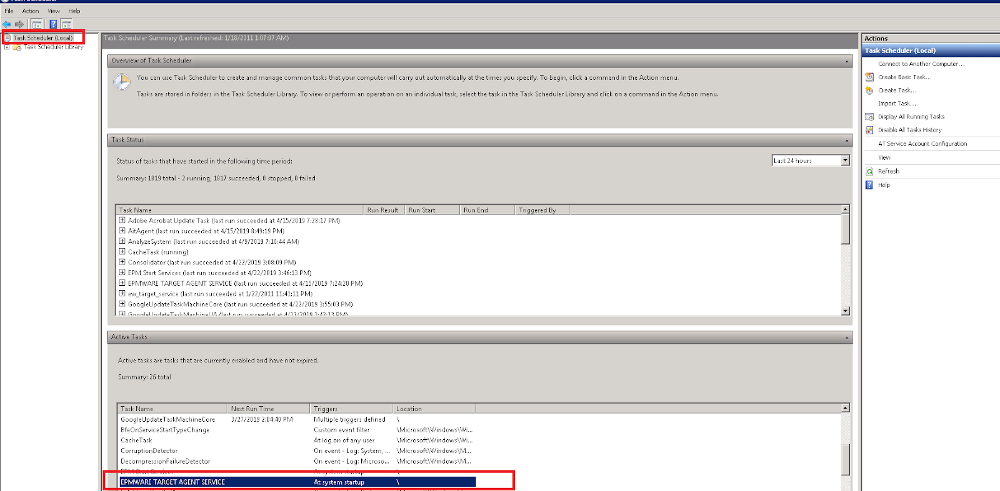<br/>

- Double Click on the scheduled task “EPMWARE TARGET AGENT SERVICE”.
Click on *Run* under Actions Menu to start the Scheduled Task. When Server
reboots this process will automatically start.

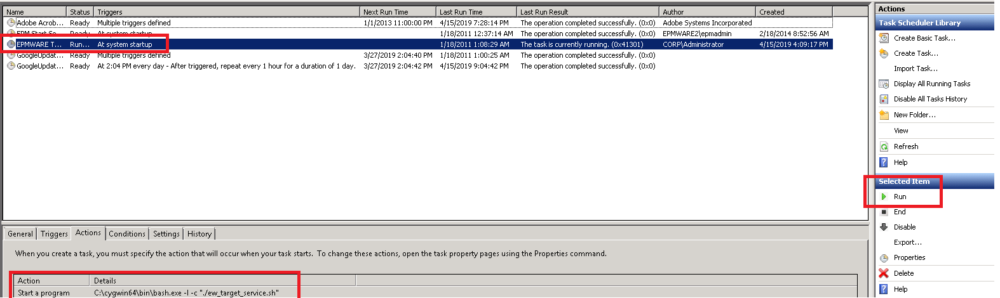<br/>

- Verify the Service is running by checking the Agent Log file as shown below.

    - Open the **agent-poll.log** file and see contents populating every 5 seconds (or frequency set in agent configuration file)
    - Open the **agent.log** file and check for errors if there are any.
  
- To End the process (in case you modify the `agent.properties`) use the Task Scheduler to End the process and Start again.

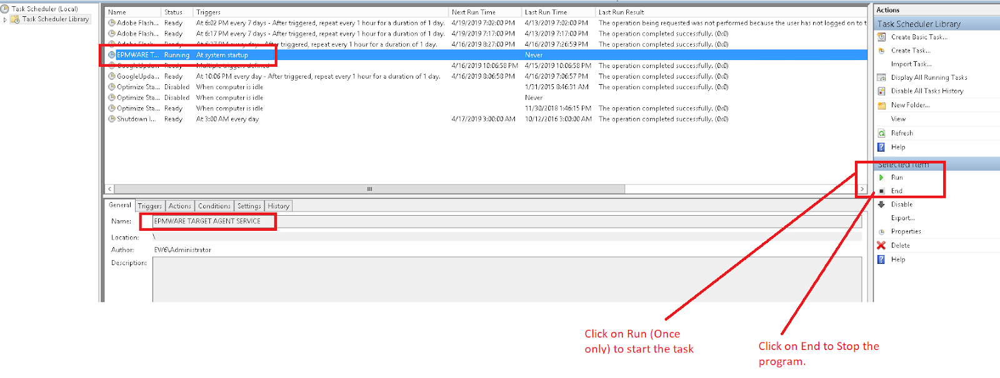<br/>


