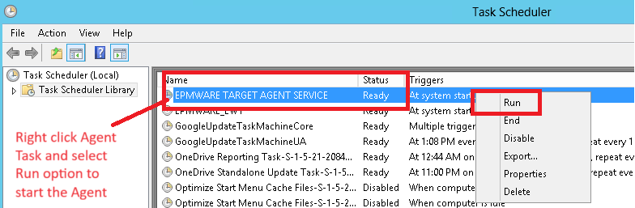
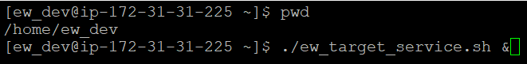
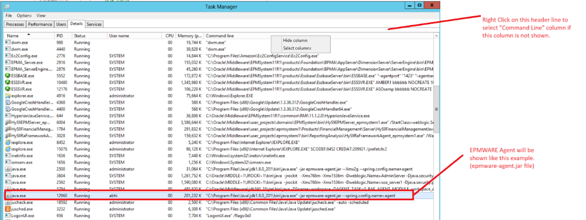
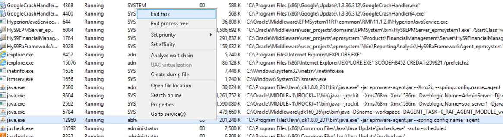
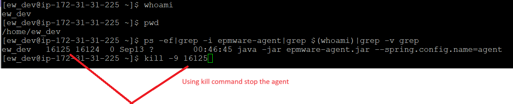

# **How to Start and Stop Agent on Windows Servers**

## Start Agent on Windows Server

Logon to the Windows server where EPMWARE Agent is installed. Using Windows Task scheduler, find the scheduled task for EPMWARE Agent as shown below. If the status is
“Ready” then start the Agent. If the status is “Running” then Stop the Agent first as mentioned in the Stop Agent section.

 

 

## Start Agent on Linux Server

Logon to the Linux server where EPMWARE agent is installed. Login as the user under
which agents are installed. Execute service command `“./ew_target_service.sh &”` (ampersand character makes the process run in the background).

 

##Stop Agent on Windows Server

Logon to the Windows server where EPMWARE Agent is installed. Using Windows Task
Manager, find the Java process as shown below. Command Line column will have
`“epmware-agent.jar”` listed. Right click on that task and select “End Task” to stop the
Agent.

 

 

Optionally remove (or archive) old Agent Logfiles as shown below.
Using Windows navigate to the cygwin folder where agents are installed. For
example, as shown below EPMWARE agent is installed in C drive under Administrator user. 
Agent Logfiles will have the prefix of “agent” and file extension log.
Either delete OR archive these agent logfiles so that when you restart agent new files will
get generated. If error message is shown while deleting these logfiles then it means the
agent process is still running.

 

## Stop Agent on Linux Server
Logon to the Linux server where EPMWARE Agent is installed. 
Find the process id (pid) using the following command and then using kill command stop
the agent.

`ps -ef|grep -i epmware-agent|grep $(whoami)|grep -v grep kill -9 <process id>`

 

