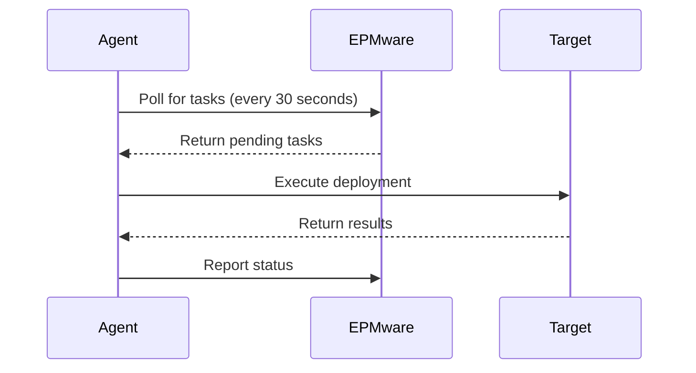

# Architecture Overview

## On-Premise Agent Architecture

The EPMware On-Premise Agent provides a secure bridge between EPMware Cloud applications and your on-premise target systems. This architecture ensures that your internal applications remain protected while enabling seamless metadata management.

 
*EPMware On-Premise Agent Architecture - Showing the flow between EPMware Cloud, On-Premise Agent, and Target Applications*

## Key Components

### 1. EPMware Cloud Application

The cloud-based EPMware application serves as the central hub for:

- Metadata request management
- Workflow orchestration
- User interface and dashboards
- REST API endpoints
- Deployment scheduling

### 2. On-Premise Agent

The agent acts as an intermediary, providing:

- **Secure Communication** - REST API-based authentication with tokens
- **Command Execution** - Processes deployment commands from EPMware
- **Status Reporting** - Returns execution results to EPMware
- **Polling Mechanism** - Checks for pending tasks at configured intervals

### 3. Target Applications

Supported on-premise applications include:

- Hyperion Financial Management (HFM)
- Hyperion Planning
- Essbase
- Other EPM applications

## Communication Flow

### 1. Polling Process

### 2. Data Flow

1. **Request Initiation** - Users submit metadata requests through EPMware UI
2. **Workflow Processing** - Requests move through approval workflow
3. **Deployment Queue** - Approved requests are queued for deployment
4. **Agent Polling** - Agent checks for pending deployments
5. **Command Execution** - Agent executes deployment to target application
6. **Status Update** - Results are reported back to EPMware

## Security Architecture

### Authentication Layers

1. **EPMware Authentication**
   - REST API token-based authentication
   - 36-character alphanumeric tokens
   - Secure HTTPS communication

2. **Target Application Authentication**
   - Application-specific credentials
   - Encrypted password files
   - Service account authentication

### Network Security

- **Firewall Protection** - Only outbound connections required
- **SSL/TLS Encryption** - All communication encrypted
- **No Inbound Ports** - Agent initiates all connections
- **Token Rotation** - Periodic token refresh capability

## Deployment Models

### Single Agent Configuration

Best for organizations with:
- Single data center
- Co-located EPM applications
- Centralized IT management

 
*Single agent serving multiple target applications*

### Multiple Agent Configuration

Recommended for:
- Geographically distributed applications
- Different security zones
- Load distribution requirements

 
*Multiple agents for distributed deployment*

### Hybrid Cloud Configuration

For organizations using both cloud and on-premise applications:

 
*Hybrid architecture with both cloud and on-premise targets*

## Agent Components

### Core Files

| File/Directory | Purpose |
|---------------|---------|
| `epmware-agent.jar` | Main agent executable |
| `agent.properties` | Configuration settings |
| `ew_target_service.sh` | Service startup script |
| `logs/` | Agent log files |
| `temp/` | Temporary working directory |

### Process Architecture

The agent runs as:
- **Windows**: Scheduled Task or Windows Service
- **Linux**: Background daemon process

## Performance Considerations

### Polling Frequency

- **Default**: 30 seconds
- **Minimum**: 10 seconds (high-frequency deployments)
- **Maximum**: 300 seconds (low-frequency deployments)

### Resource Usage

- **Memory**: ~512MB - 2GB depending on deployment size
- **CPU**: Minimal during polling, increases during deployment
- **Network**: Burst traffic during metadata transfer
- **Disk I/O**: Temporary files during processing

## High Availability Options

### Active-Passive Configuration

- Primary agent handles all requests
- Standby agent activated on failure
- Manual or automated failover

### Load Balanced Configuration

- Multiple agents with shared workload
- Application-based distribution
- Improved throughput for large deployments

## Monitoring and Management

### Health Checks

The agent provides several monitoring capabilities:

- Connection status verification
- Deployment success/failure metrics
- Response time tracking
- Error logging and alerting

### Log Management

Two primary log files:
1. **agent.log** - Deployment activities and errors
2. **agent-poll.log** - Polling activity tracking

## Integration Points

### EPMware Integration

- REST API for communication
- JSON-based message format
- Asynchronous task processing

### Application Integration

- **HFM**: HFM utilities and command-line tools
- **Planning**: Planning utilities and encrypted credentials
- **Cloud EPM**: EPM Automate utility
- **Custom**: Scriptable integration points

## Scalability Considerations

The architecture supports:

- **Vertical Scaling**: Increase server resources for larger deployments
- **Horizontal Scaling**: Add agents for distributed processing
- **Queue Management**: Handle multiple concurrent deployments
- **Batch Processing**: Group deployments for efficiency

!!! tip "Best Practice"
    For production environments, implement agent redundancy to ensure continuous availability of metadata deployment capabilities.

!!! note "Cloud vs On-Premise"
    While EPMware can be deployed either on-premise or in the cloud, the agent architecture remains consistent, with only the connection endpoints changing.

## Next Steps

Now that you understand the architecture:

1. Review [Installation Prerequisites](../installation/prerequisites/index.md)
2. Proceed with [Agent Installation](../installation/agent/index.md)
3. Configure [Agent Properties](../configuration/agent-properties.md)