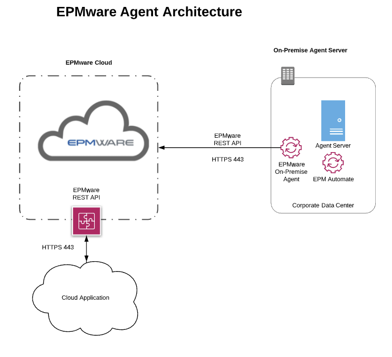

# Architecture Overview

## On-Premise Agent Architecture

The EPMware On-Premise Agent provides a secure bridge between EPMware Cloud applications and your on-premise target systems. 

This architecture ensures that your internal applications remain protected while enabling seamless metadata management.

 
*EPMware On-Premise Agent Architecture - Showing the flow between EPMware Cloud, On-Premise Agent, and Target Applications*

