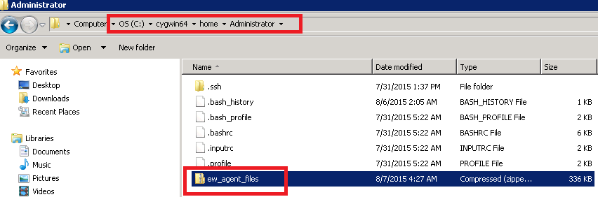
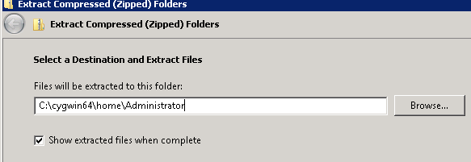
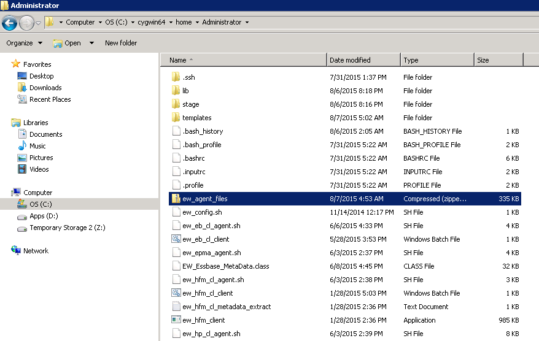

# Prerequisites Software Installation

## **Install Cygwin**

If the EPMware application is installed on a Windows server, install cygwin if it is not
already installed. In addition to this server, Cygwin will need to be installed on all target
servers which have windows o/s and target application are managed by EPMWARE.

Download cygwin from `www.cygwin.com` and follow instructions on the cygwin site:
<http://cygwin.com/install.html>

**Install CYGWIN**

1. Download Cygwin and save the `setup.exe` file to your Desktop.

2. Run the `setup.exe` file.

3. Select the defaults for the following options:
    - **Install from Internet**
    - **Install Root Directory:** `C:\cygwin`
    - **Install for All Users**

4. Specify a folder for the local package directory that is not the Cygwin root folder.  
   Example: `C:\cygwin\packages`

5. Specify the connection method.  
   For example, if the host is connected to the Internet through a proxy server, specify the proxy server.

6. Select the mirror site from which to download the software.

## **Install EPMware Agent**

The Agent is required to be installed on each server where EPMware either imports or
exports metadata directly. These files are placed under the home directory of the
CYGWIN user.

In the example below, the agent files are installed on a Windows server

CYGWIN user name      : `Administrator` 
CYGWIN home directory : `C:\cygwin64\home\Administrator`  
EPMware Agent zip file: `ew_agent_files.zip`

## **Install the Agent on the Target Server**

1. Logon to the server where the agent will be installed
2. Go to the home directory of the CYGWIN user
3. Unzip Agent zip file `ew_agent_files.zip` directly under the home directory

 
4. Select the home directory of the user to extract the zip file. By default, it will have `ew_agent_files folder` in it which will need to be removed.

 
5. After extracting, the folder should look like the following:

 

