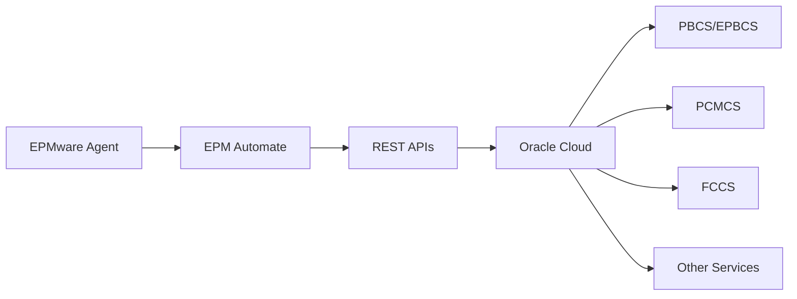

# Oracle Cloud EPM Integration

This section covers the configuration and integration of the EPMware Agent with Oracle Cloud EPM applications.

## Overview

Cloud EPM integration enables EPMware to manage metadata for:
- Planning and Budgeting Cloud Service (PBCS)
- Enterprise Planning and Budgeting Cloud Service (EPBCS)
- Profitability and Cost Management Cloud Service (PCMCS)
- Financial Consolidation and Close Cloud Service (FCCS)
- Account Reconciliation Cloud Service (ARCS)
- Tax Reporting Cloud Service (TRCS)

## Integration Components

<div class="grid cards" markdown>

- :material-cloud: **[PCMCS Configuration](pcmcs.md)**  
  Profitability and Cost Management setup
  
- :material-console: **[EPM Automate](epm-automate.md)**  
  Command-line utility installation and usage
  
- :material-update: **[Upgrade Process](upgrade.md)**  
  Keeping cloud tools and connections current

</div>

## Cloud Architecture



## Prerequisites

### Software Requirements

| Component | Version | Purpose |
|-----------|---------|---------|
| EPM Automate | Latest | Cloud interaction utility |
| Java | 1.8+ | EPM Automate requirement |
| Internet Access | Stable | Cloud connectivity |
| TLS Support | 1.2+ | Secure communication |

### Cloud Requirements

- Oracle Cloud EPM subscription
- Service Administrator role
- Identity domain information
- Service URL

## Quick Setup Guide

### Step 1: Install EPM Automate

**Windows:**
```powershell
# Download installer from Oracle Cloud
# Run EPM Automate.exe as administrator
# Default installation: C:\Oracle\EPM Automate
```

**Linux:**
```bash
# Download EPM Automate
wget https://cloud-url/EPMAutomate.tar

# Extract
tar xf EPMAutomate.tar -C ~
export PATH=$PATH:~/epmautomate/bin

# Verify installation
epmautomate --version
```

### Step 2: Test Cloud Connection

```bash
# Login to cloud service
epmautomate login ServiceAdmin Password https://instance.oraclecloud.com IdentityDomain

# List files to verify connection
epmautomate listfiles

# Logout
epmautomate logout
```

### Step 3: Configure Agent

Add to `agent.properties`:
```properties
# Cloud configuration
cloud.enabled=true
cloud.url=https://instance.oraclecloud.com
cloud.identityDomain=mycompany
cloud.user=ServiceAdmin
cloud.epmautomate.path=/home/epmware/epmautomate/bin
```

## Cloud Service Types

### PBCS/EPBCS

Planning and Budgeting services:
```bash
# Connect to PBCS
epmautomate login admin password https://planning-instance.pbcs.us2.oraclecloud.com myDomain

# Deploy metadata
epmautomate uploadfile metadata.zip
epmautomate importmetadata metadata.zip
epmautomate deletefile metadata.zip
```

### PCMCS

Profitability and Cost Management:
```bash
# Connect to PCMCS
epmautomate login admin password https://pcmcs-instance.pcmcs.us2.oraclecloud.com myDomain

# Deploy to PCMCS
epmautomate uploadfile dimension.zip
epmautomate importdimension dimension.zip
```

### FCCS

Financial Consolidation and Close:
```bash
# Connect to FCCS
epmautomate login admin password https://fccs-instance.fccs.us2.oraclecloud.com myDomain

# Import metadata
epmautomate uploadfile fccs_metadata.csv
epmautomate importmetadata fccs_metadata.csv
```

## Authentication Methods

### Password Authentication

```bash
# Direct password
epmautomate login username password URL identityDomain

# Password file
echo "password" > .pwd_file
epmautomate login username .pwd_file URL identityDomain
```

### OAuth 2.0 Authentication

```bash
# OAuth setup
epmautomate login username password URL identityDomain AuthType=OAuth

# Use refresh token
epmautomate login username refreshToken URL identityDomain AuthType=OAuth RefreshToken=true
```

### SSO Authentication

```properties
# For SSO-enabled services
cloud.auth.type=SSO
cloud.auth.provider=OKTA
cloud.auth.endpoint=https://company.okta.com
```

## EPM Automate Operations

### Common Commands

| Command | Purpose | Example |
|---------|---------|---------|
| `uploadfile` | Upload file to cloud | `epmautomate uploadfile data.zip` |
| `downloadfile` | Download from cloud | `epmautomate downloadfile data.zip` |
| `importmetadata` | Import metadata | `epmautomate importmetadata file.zip` |
| `exportmetadata` | Export metadata | `epmautomate exportmetadata file.zip` |
| `runbusinessrule` | Execute rule | `epmautomate runbusinessrule RuleName` |
| `refreshcube` | Refresh database | `epmautomate refreshcube` |

### Batch Operations

```bash
#!/bin/bash
# batch_deploy.sh

# Login
epmautomate login $USER $PASSWORD $URL $DOMAIN

# Upload and import multiple files
for file in *.zip; do
    echo "Processing $file..."
    epmautomate uploadfile "$file"
    epmautomate importmetadata "$file"
    epmautomate deletefile "$file"
done

# Logout
epmautomate logout
```

## Connection Configuration

### Network Requirements

```yaml
Required Ports:
  - 443 (HTTPS)
  
Required Protocols:
  - TLS 1.2+
  - HTTP/2 (preferred)
  
Firewall Rules:
  - Allow outbound to *.oraclecloud.com
  - Allow outbound to *.oracle.com
```

### Proxy Configuration

```bash
# Set proxy for EPM Automate
export HTTPS_PROXY=http://proxy.company.com:8080
export HTTP_PROXY=http://proxy.company.com:8080

# Or in command
epmautomate login user pwd url domain ProxyHost=proxy.company.com ProxyPort=8080
```

### Timeout Settings

```properties
# Connection timeouts
cloud.connection.timeout=60000
cloud.read.timeout=300000
cloud.operation.timeout=1800000
```

## Security Configuration

### Secure Credential Storage

```bash
# Encrypt password file
openssl enc -aes-256-cbc -salt -in password.txt -out password.enc

# Decrypt when needed
openssl enc -aes-256-cbc -d -in password.enc -out password.txt

# Use encrypted file
epmautomate login user password.enc url domain Encrypted=true
```

### Certificate Management

```bash
# Import Oracle Cloud certificate
keytool -import -trustcacerts -alias oraclecloud \
        -file oracle-cloud.crt \
        -keystore $JAVA_HOME/lib/security/cacerts
```

### Audit and Compliance

```properties
# Enable audit logging
cloud.audit.enabled=true
cloud.audit.detailed=true
cloud.audit.includeData=false
```

## Performance Optimization

### Parallel Processing

```bash
#!/bin/bash
# parallel_deploy.sh

# Function to deploy
deploy_file() {
    local file=$1
    epmautomate uploadfile "$file"
    epmautomate importmetadata "$file"
}

# Process files in parallel
export -f deploy_file
find . -name "*.zip" | parallel -j 4 deploy_file
```

### Connection Pooling

```properties
# EPM Automate connection settings
cloud.connection.pool.enabled=true
cloud.connection.pool.size=5
cloud.connection.keepAlive=true
```

### Compression

```bash
# Enable compression for uploads
epmautomate uploadfile largefile.zip Compression=true

# Compress before upload
gzip -9 metadata.csv
epmautomate uploadfile metadata.csv.gz
```

## Monitoring and Logging

### Health Checks

```bash
#!/bin/bash
# cloud_health_check.sh

# Test connectivity
if epmautomate login $USER $PWD $URL $DOMAIN; then
    echo "✓ Cloud connection successful"
    
    # Check service status
    epmautomate getstatus
    
    # Logout
    epmautomate logout
else
    echo "✗ Cloud connection failed"
    exit 1
fi
```

### Log Configuration

```properties
# EPM Automate logging
epmautomate.log.enabled=true
epmautomate.log.level=INFO
epmautomate.log.file=/var/log/epmware/epmautomate.log
```

### Activity Monitoring

```bash
# Monitor EPM Automate operations
epmautomate listjobs
epmautomate getjobstatus JobID
epmautomate getactivityreport
```

## Troubleshooting

### Common Issues

| Issue | Cause | Solution |
|-------|-------|----------|
| Login fails | Invalid credentials | Verify username/password/domain |
| Connection timeout | Network issues | Check firewall and proxy |
| Upload fails | File too large | Split file or increase timeout |
| Import fails | Invalid format | Validate file format |
| TLS error | Certificate issue | Update certificates |

### Debug Mode

```bash
# Enable debug logging
export EPM_AUTOMATE_LOG_LEVEL=DEBUG

# Run with verbose output
epmautomate login user pwd url domain -v

# Check debug logs
tail -f ~/epmautomate/logs/epmautomate.log
```

## Best Practices

### Security Best Practices

1. **Never hardcode passwords** - Use encrypted files
2. **Rotate credentials regularly** - Monthly for production
3. **Use service accounts** - Not personal accounts
4. **Enable MFA** - Where available
5. **Audit all operations** - Track who did what

### Operational Best Practices

1. **Test in sandbox first** - Never test in production
2. **Backup before changes** - Export existing metadata
3. **Use maintenance windows** - Schedule deployments
4. **Monitor operations** - Check job status
5. **Document procedures** - Keep runbooks updated

### Performance Best Practices

1. **Batch operations** - Group related changes
2. **Compress large files** - Reduce transfer time
3. **Use parallel processing** - For multiple files
4. **Implement retries** - Handle transient failures
5. **Monitor bandwidth** - Avoid network saturation

## Cloud-Specific Configurations

### Data Center Regions

```properties
# Region-specific URLs
cloud.region.us=.oraclecloud.com
cloud.region.eu=.eu.oraclecloud.com
cloud.region.ap=.ap.oraclecloud.com

# Select region
cloud.datacenter=us2
```

### Service Limits

Be aware of cloud service limits:
- File upload size: 2GB typical
- Concurrent connections: 10-20
- API rate limits: 100 requests/minute
- Job execution time: 2 hours maximum

## Integration Testing

### Test Scripts

```bash
#!/bin/bash
# test_cloud_integration.sh

echo "=== Cloud Integration Test ==="

# Test login
echo "Testing login..."
epmautomate login $USER $PWD $URL $DOMAIN || exit 1

# Test file operations
echo "Testing file upload..."
echo "test" > test.txt
epmautomate uploadfile test.txt || exit 1

echo "Testing file download..."
epmautomate downloadfile test.txt test_download.txt || exit 1

echo "Testing file deletion..."
epmautomate deletefile test.txt || exit 1

# Logout
epmautomate logout

echo "=== All tests passed ==="
```

## Migration from On-Premise

### Migration Checklist

- [ ] Install EPM Automate
- [ ] Configure cloud credentials
- [ ] Test connectivity
- [ ] Export on-premise metadata
- [ ] Transform metadata format if needed
- [ ] Import to cloud
- [ ] Validate deployment
- [ ] Update agent configuration
- [ ] Test end-to-end process
- [ ] Document new procedures

## Next Steps

- [PCMCS Configuration](pcmcs.md) - Set up PCMCS integration
- [EPM Automate Setup](epm-automate.md) - Detailed utility configuration
- [Upgrade Process](upgrade.md) - Keep tools current
- [Planning Integration](../planning/index.md) - On-premise Planning

!!! tip "Cloud Updates"
    Oracle frequently updates cloud services. Check for EPM Automate updates monthly and review release notes for new features and changes.

!!! warning "Rate Limits"
    Be aware of API rate limits in cloud services. Implement throttling and retry logic to handle rate limit errors gracefully.