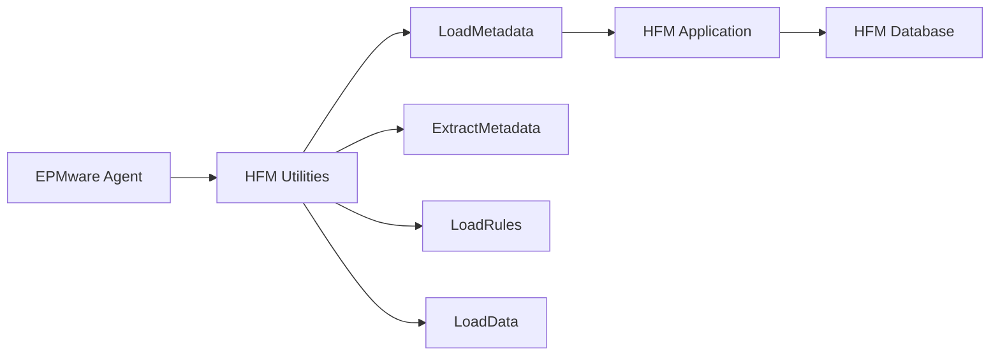

# Hyperion HFM Integration

This section covers the configuration and integration of the EPMware Agent with Oracle Hyperion Financial Management (HFM) applications.

## Overview

HFM integration enables EPMware to:
- Import metadata from HFM applications
- Deploy dimension changes
- Manage calculation rules
- Load and extract data
- Execute consolidations

## Integration Components

<div class="grid cards" markdown>

- :material-cog: **[Configuration](configuration.md)**  
  HFM-specific agent configuration
  
- :material-file-document: **[Registry Properties](registry.md)**  
  Registry file setup and management

</div>

## HFM Architecture



## Prerequisites

### Software Requirements

| Component | Version | Location |
|-----------|---------|----------|
| HFM | 11.1.2.4+ | Application server |
| Java | 1.8+ | System PATH |
| HFM Utilities | Matching HFM version | `$EPM_ORACLE_HOME/products/FinancialManagement/bin` |
| Registry Properties | HFM version | Foundation config directory |

### User Requirements

The HFM user account needs:
- Application Administrator role
- Metadata Load privileges
- Dimension Editor access
- Rules Administrator (if managing rules)
- Data Load privileges (if loading data)

## Quick Setup Guide

### Step 1: Verify HFM Installation

```bash
# Check HFM utilities location
ls $EPM_ORACLE_HOME/products/FinancialManagement/bin/

# Key utilities needed:
# - LoadMetadata.exe/sh
# - ExtractMetadata.exe/sh
# - LoadRules.exe/sh
# - LoadData.exe/sh
```

### Step 2: Configure Registry Properties

```bash
# Copy registry file (Critical for HFM)
cp $MIDDLEWARE/user_projects/config/foundation/11.1.2.0/reg.properties \
   $MIDDLEWARE/user_projects/epmsystem1/config/foundation/11.1.2.0/

# Verify copy
ls -la $MIDDLEWARE/user_projects/epmsystem1/config/foundation/11.1.2.0/reg.properties
```

### Step 3: Configure EPMware

1. Navigate to **Configuration** → **Applications**
2. Select HFM application
3. Configure connection parameters:
   - Server name
   - Cluster name
   - Application name
   - Credentials

### Step 4: Test Connection

```cmd
REM Windows test
LoadMetadata.exe -a:HFMAPP -u:admin -p:password -test

# Linux test
LoadMetadata.sh -a:HFMAPP -u:admin -p:password -test
```

## Configuration in EPMware

### Application Settings

Configure these settings in EPMware for HFM:

| Parameter | Description | Example |
|-----------|-------------|---------|
| **Application Name** | HFM application name | HFMPROD |
| **Server** | HFM server hostname | hfm.company.com |
| **Cluster** | HFM cluster name | Cluster1 |
| **Port** | HFM port | 19000 |
| **User** | HFM admin user | admin |
| **Password** | Encrypted password | {encrypted}xxx |
| **Database** | HFM database | HFMDB |

### Agent Configuration

Add to `agent.properties`:

```properties
# HFM configuration
hfm.enabled=true
hfm.server=hfm.company.com
hfm.cluster=Cluster1
hfm.port=19000
hfm.timeout=3600

# Utility paths
hfm.loadmetadata.path=/opt/Oracle/products/FinancialManagement/bin/LoadMetadata.sh
hfm.extractmetadata.path=/opt/Oracle/products/FinancialManagement/bin/ExtractMetadata.sh
hfm.loadrules.path=/opt/Oracle/products/FinancialManagement/bin/LoadRules.sh

# Deployment options
hfm.deployment.backup=true
hfm.deployment.validate=true
hfm.deployment.clearAll=false
```

## Deployment Operations

### Metadata Import from HFM

```bash
# Extract all metadata
ExtractMetadata.exe -a:HFMAPP -u:admin -p:password \
    -e:All -f:backup.xml

# Extract specific dimensions
ExtractMetadata.exe -a:HFMAPP -u:admin -p:password \
    -e:Entity,Account -f:dimensions.xml

# Extract with options
ExtractMetadata.exe -a:HFMAPP -u:admin -p:password \
    -e:Entity -f:entity.xml -l:logfile.log
```

### Metadata Export to HFM

```bash
# Load metadata (merge mode)
LoadMetadata.exe -a:HFMAPP -u:admin -p:password \
    -f:metadata.xml -m:Merge

# Load metadata (replace mode)
LoadMetadata.exe -a:HFMAPP -u:admin -p:password \
    -f:metadata.xml -m:Replace

# Load with validation
LoadMetadata.exe -a:HFMAPP -u:admin -p:password \
    -f:metadata.xml -m:Validate
```

### Supported Operations

| Operation | Command | Description |
|-----------|---------|-------------|
| Merge | `-m:Merge` | Add/update members |
| Replace | `-m:Replace` | Replace entire dimension |
| Validate | `-m:Validate` | Validate without loading |
| Clear | `-m:Clear` | Clear dimension first |

## HFM Dimensions

### Standard HFM Dimensions

| Dimension | Type | Description |
|-----------|------|-------------|
| Entity | Hierarchy | Organization structure |
| Account | Hierarchy | Chart of accounts |
| Scenario | Flat | Budget/Actual/Forecast |
| Period | System | Time periods |
| Year | System | Fiscal years |
| Value | System | Currency/adjustments |
| Custom1-4 | User-defined | Custom dimensions |
| ICP | Flat | Intercompany partners |

### Metadata File Format

```xml
<?xml version="1.0" encoding="UTF-8"?>
<HFM>
  <Dimension name="Entity">
    <Member name="E1000" description="North America">
      <Property name="Currency" value="USD"/>
      <Property name="SecurityClass" value="Default"/>
      <Member name="E1100" description="United States"/>
      <Member name="E1200" description="Canada"/>
    </Member>
  </Dimension>
</HFM>
```

## Rules Management

### Load Calculation Rules

```bash
# Load rules file
LoadRules.exe -a:HFMAPP -u:admin -p:password \
    -f:calc_rules.txt -m:Replace

# Load with backup
LoadRules.exe -a:HFMAPP -u:admin -p:password \
    -f:calc_rules.txt -m:Replace -b:backup_rules.txt
```

### Extract Rules

```bash
# Extract all rules
ExtractRules.exe -a:HFMAPP -u:admin -p:password \
    -f:rules_backup.txt

# Extract specific rule type
ExtractRules.exe -a:HFMAPP -u:admin -p:password \
    -f:calc_rules.txt -t:Calculation
```

## Data Operations

### Load Data

```bash
# Load data file
LoadData.exe -a:HFMAPP -u:admin -p:password \
    -f:data.dat -m:Replace

# Load with POV
LoadData.exe -a:HFMAPP -u:admin -p:password \
    -f:data.dat -s:Actual -y:2023 -p:January
```

### Extract Data

```bash
# Extract data
ExtractData.exe -a:HFMAPP -u:admin -p:password \
    -f:data_export.dat -s:Actual -y:2023
```

## Security Configuration

### User Provisioning

Required HFM roles:
```
- Application Administrator
- Metadata Manager
- Rules Manager
- Load System
```

### Secure Credentials

```properties
# Encrypted password in agent.properties
hfm.password={encrypted}AES256:abcd1234...

# Or use external credential store
hfm.password.provider=vault
hfm.password.key=hfm/prod/admin
```

## Performance Optimization

### Batch Processing

```properties
# Batch configuration
hfm.batch.enabled=true
hfm.batch.size=5000
hfm.batch.threads=4
```

### Connection Pooling

```properties
# Connection pool settings
hfm.pool.enabled=true
hfm.pool.min=2
hfm.pool.max=10
hfm.pool.timeout=30000
```

### Memory Settings

```bash
# Set heap size for HFM utilities
export HFM_JVM_OPTIONS="-Xms2048m -Xmx4096m"
```

## Troubleshooting

### Common Issues

| Issue | Cause | Solution |
|-------|-------|----------|
| Registry not found | reg.properties missing | Copy to EPM instance folder |
| Connection failed | Wrong cluster/server | Verify HFM configuration |
| Load fails | Invalid XML format | Validate XML structure |
| Permission denied | Insufficient privileges | Grant required HFM roles |
| Timeout | Large metadata file | Increase timeout setting |

### Debug Mode

Enable debug logging:

```bash
# Set environment variables
export HFM_DEBUG=true
export HFM_LOG_LEVEL=TRACE

# Run with debug
LoadMetadata.exe -a:HFMAPP -u:admin -p:password \
    -f:metadata.xml -l:debug.log -v
```

### Log Files

Check these logs for issues:

```bash
# HFM logs
$EPM_ORACLE_INSTANCE/diagnostics/logs/FinancialManagement/HFM.log

# Agent logs
tail -f /home/epmware/logs/agent.log | grep -i hfm

# Windows Event Log
eventvwr.msc → Applications and Services → HFM
```

## Best Practices

### Deployment Strategy

1. **Always backup first** - Extract before loading
2. **Validate before load** - Use validation mode
3. **Test in non-production** - Never test in prod
4. **Schedule off-hours** - Minimize user impact
5. **Monitor closely** - Check logs during deployment

### Metadata Standards

1. **Naming conventions** - Consistent member names
2. **Description standards** - Meaningful descriptions
3. **Security classes** - Proper assignments
4. **Currency settings** - Correct for entities
5. **Custom properties** - Document usage

### Maintenance

1. **Regular backups** - Daily metadata extracts
2. **Archive old files** - Compress and store
3. **Clean temp files** - Remove after processing
4. **Update documentation** - Keep current
5. **Review logs** - Check for warnings

## Monitoring

### Health Checks

```bash
#!/bin/bash
# check_hfm.sh

# Check HFM process
ps aux | grep -i hfm

# Test connection
timeout 10 LoadMetadata.exe -test

# Check port
nc -zv hfm-server 19000
```

### Deployment Metrics

Track these metrics:
- Deployment duration
- Success rate
- Error frequency
- Metadata size
- Rule complexity

## Integration Checklist

Before production:

- [ ] HFM utilities accessible
- [ ] Registry properties copied
- [ ] User has required roles
- [ ] Network connectivity verified
- [ ] Test deployment successful
- [ ] Backup procedures in place
- [ ] Monitoring configured
- [ ] Documentation updated
- [ ] Rollback plan prepared
- [ ] Change control approved

## Sample Scripts

### Backup Script

```bash
#!/bin/bash
# backup_hfm.sh

DATE=$(date +%Y%m%d_%H%M%S)
BACKUP_DIR="/backup/hfm/$DATE"
mkdir -p $BACKUP_DIR

# Extract all metadata
ExtractMetadata.exe -a:HFMAPP -u:admin -p:password \
    -e:All -f:$BACKUP_DIR/metadata.xml

# Extract rules
ExtractRules.exe -a:HFMAPP -u:admin -p:password \
    -f:$BACKUP_DIR/rules.txt

# Compress
tar -czf $BACKUP_DIR.tar.gz $BACKUP_DIR
rm -rf $BACKUP_DIR
```

### Deployment Script

```bash
#!/bin/bash
# deploy_hfm.sh

# Validate first
LoadMetadata.exe -a:HFMAPP -u:admin -p:password \
    -f:metadata.xml -m:Validate

if [ $? -eq 0 ]; then
    # Load if validation passes
    LoadMetadata.exe -a:HFMAPP -u:admin -p:password \
        -f:metadata.xml -m:Merge
else
    echo "Validation failed"
    exit 1
fi
```

!!! tip "Version Matching"
    Always ensure HFM utilities version matches your HFM application version to avoid compatibility issues.

!!! warning "Registry Properties Critical"
    The reg.properties file MUST be copied to the EPM instance folder or HFM operations will fail with cryptic errors.

## Next Steps

- [HFM Configuration Details](configuration.md) - Detailed setup
- [Registry Properties](registry.md) - Registry file management
- [Planning Integration](../planning/index.md) - Planning setup
- [Cloud Integration](../cloud/index.md) - Cloud services