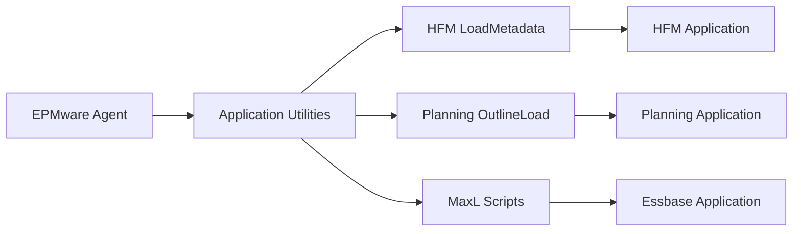
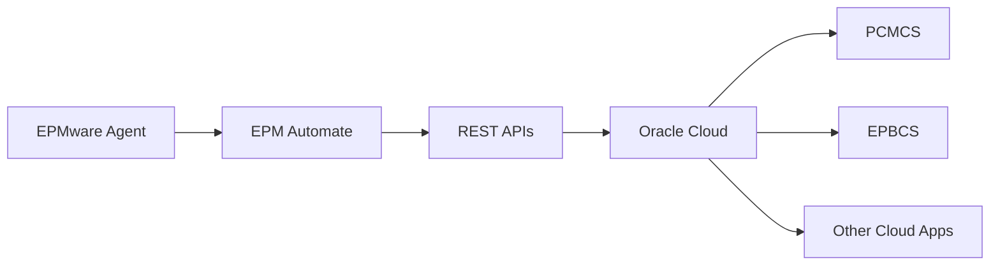

# Application Integration Overview

This section covers the configuration required to integrate the EPMware Agent with specific EPM applications. Each application has unique requirements and setup procedures.

## Supported Applications

<div class="grid cards" markdown>

- :material-chart-box: **[Hyperion HFM](hfm/index.md)**  
  Financial Management integration with registry configuration
  
- :material-calculator: **[Hyperion Planning](planning/index.md)**  
  Planning and Budgeting application integration
  
- :material-cloud: **[Oracle Cloud EPM](cloud/index.md)**  
  PCMCS, EPBCS, and other cloud applications

</div>

## Integration Architecture

### On-Premise Applications

For on-premise EPM applications, the agent communicates directly with application utilities:



### Cloud Applications

For cloud applications, the agent uses EPM Automate:



## Quick Setup Guide

### Step 1: Identify Target Applications

Determine which applications need integration:

```bash
# List installed EPM applications (Linux)
ls /opt/Oracle/Middleware/EPMSystem*/products/

# Windows
dir "C:\Oracle\Middleware\EPMSystem*\products\"
```

### Step 2: Verify Application Access

Ensure the agent can access application utilities:

```bash
# HFM utilities
ls $EPM_ORACLE_HOME/products/FinancialManagement/bin/

# Planning utilities
ls $EPM_ORACLE_HOME/products/Planning/bin/

# Essbase MaxL
which startMaxl.sh
```

### Step 3: Configure Application Settings

Add application-specific settings to EPMware:

1. Navigate to **Configuration** → **Applications**
2. Select your application
3. Configure connection parameters
4. Test connectivity

## Integration Requirements Matrix

| Application | Version | Requirements | Configuration Needed |
|------------|---------|--------------|---------------------|
| **HFM** | 11.1.2.4+ | Registry file, HFM utilities | Copy reg.properties |
| **Planning** | 11.1.2.4+ | Password file, Planning utilities | Generate encrypted password |
| **Essbase** | 11.1.2.4+ | MaxL, credentials | MaxL scripts |
| **PCMCS** | Cloud | EPM Automate, internet access | Install EPM Automate |
| **EPBCS** | Cloud | EPM Automate, identity domain | Cloud credentials |

## Common Integration Tasks

### Metadata Deployment

The agent handles various metadata operations:

- **Import** - Extract metadata from applications
- **Export** - Deploy metadata to applications
- **Validation** - Verify metadata before deployment
- **Backup** - Create backups before changes
- **Rollback** - Restore previous versions if needed

### Supported Operations by Application

| Application | Import | Export | Clear | Backup | Rules |
|------------|--------|--------|-------|--------|-------|
| HFM | ✓ | ✓ | ✓ | ✓ | ✓ |
| Planning | ✓ | ✓ | ✓ | ✓ | ✓ |
| Essbase | ✓ | ✓ | ✓ | ✓ | ✓ |
| PCMCS | ✓ | ✓ | ✓ | ✓ | ✓ |
| EPBCS | ✓ | ✓ | ✓ | ✓ | ✓ |

## Configuration Files

### Application Properties

Each application requires specific properties in EPMware:

```properties
# HFM Example
hfm.server=hfm-server.company.com
hfm.cluster=Cluster1
hfm.application=HFMPROD
hfm.user=hfm_admin
hfm.timeout=3600

# Planning Example
planning.server=planning-server.company.com
planning.application=PLANPROD
planning.user=planning_admin
planning.passwordFile=/opt/oracle/password.txt

# Cloud Example
cloud.url=https://instance.oraclecloud.com
cloud.identityDomain=company
cloud.user=cloud.admin@company.com
```

### Agent Configuration

Add application-specific settings to `agent.properties`:

```properties
# Enable application modules
hfm.enabled=true
planning.enabled=true
cloud.enabled=true

# Set application paths
hfm.utility.path=/opt/Oracle/products/FinancialManagement/bin
planning.utility.path=/opt/Oracle/products/Planning/bin
epmautomate.path=/home/epmadmin/epmautomate/bin
```

## Security Configuration

### Credential Management

Different methods for each application type:

#### On-Premise Applications
```bash
# Encrypted password files
./PasswordEncryption.sh password.txt

# Secure wallet
mkstore -wrl ./wallet -createCredential 
```

#### Cloud Applications
```bash
# EPM Automate login
epmautomate login user password url

# Token-based auth
export EPM_TOKEN=your-token-here
```

### Access Control

Required permissions by application:

| Application | Required Role | Permissions Needed |
|------------|--------------|-------------------|
| HFM | Application Administrator | Metadata Load, Dimension Editor |
| Planning | Administrator | Dimension Editor, Data Load |
| Essbase | Application Manager | Database Manager, Calc Execute |
| Cloud EPM | Service Administrator | Application Management |

## Testing Integration

### Connection Tests

Test connectivity to each application:

```bash
# HFM Test
$HFM_HOME/bin/LoadMetadata.bat -test

# Planning Test
$PLANNING_HOME/bin/OutlineLoad.sh -test

# Cloud Test
epmautomate login user password url
epmautomate listfiles
epmautomate logout
```

### Deployment Tests

Perform test deployments:

1. Create test metadata file
2. Deploy to development environment
3. Verify deployment success
4. Check application logs

## Troubleshooting Integration

### Common Integration Issues

| Issue | Symptoms | Solution |
|-------|----------|----------|
| Utilities not found | "command not found" | Add to PATH or specify full path |
| Permission denied | Cannot execute utilities | Check file permissions and user access |
| Connection failed | Timeout or refused | Verify network and application status |
| Authentication failed | Invalid credentials | Regenerate passwords/tokens |

### Debug Integration

Enable debug logging for specific applications:

```properties
# Application-specific debug
hfm.debug=true
planning.debug=true
cloud.debug=true

# Verbose logging
application.log.verbose=true
application.log.level=TRACE
```

## Performance Optimization

### Batch Processing

Configure batch sizes for large deployments:

```properties
# Batch configuration
deployment.batch.enabled=true
deployment.batch.size=1000
deployment.batch.parallel=false
deployment.batch.threads=2
```

### Connection Pooling

Optimize connections for multiple applications:

```properties
# Connection pool settings
connection.pool.enabled=true
connection.pool.size=5
connection.pool.timeout=30000
connection.pool.validate=true
```

## Multi-Application Deployment

### Deployment Order

Configure deployment sequence:

```properties
# Deployment order (lower numbers deploy first)
hfm.deployment.order=1
essbase.deployment.order=2
planning.deployment.order=3
```

### Dependency Management

Handle application dependencies:

```properties
# Dependencies
planning.depends.on=essbase
reporting.depends.on=hfm,planning
```

## Monitoring Integration

### Health Checks

Monitor application connectivity:

```bash
#!/bin/bash
# check_applications.sh

echo "Checking HFM..."
timeout 10 $HFM_HOME/bin/HFMHealthCheck.sh

echo "Checking Planning..."
timeout 10 $PLANNING_HOME/bin/PlanningHealthCheck.sh

echo "Checking Cloud..."
timeout 10 epmautomate login $USER $PASS $URL && epmautomate logout
```

### Integration Metrics

Track integration performance:

| Metric | Target | Alert Threshold |
|--------|--------|-----------------|
| Connection Time | <5 seconds | >30 seconds |
| Deployment Duration | <5 minutes | >15 minutes |
| Success Rate | >99% | <95% |
| Error Rate | <1% | >5% |

## Best Practices

### General Guidelines

1. **Test First** - Always test in non-production
2. **Backup Always** - Create backups before deployments
3. **Monitor Closely** - Watch logs during deployments
4. **Document Changes** - Record all configuration changes
5. **Plan Maintenance** - Schedule deployment windows

### Security Best Practices

1. **Rotate Credentials** - Regular password changes
2. **Limit Access** - Minimum required permissions
3. **Encrypt Sensitive Data** - Use encrypted password files
4. **Audit Activities** - Log all operations
5. **Secure Communications** - Use SSL/TLS

### Performance Best Practices

1. **Optimize Batch Sizes** - Balance speed and resources
2. **Schedule Off-Hours** - Deploy during low usage
3. **Monitor Resources** - Track CPU and memory
4. **Clean Up** - Remove temporary files
5. **Regular Maintenance** - Update utilities and drivers

## Application-Specific Guides

Detailed configuration for each application:

### On-Premise Applications
- [Hyperion HFM Configuration](hfm/index.md)
- [Hyperion Planning Setup](planning/index.md)
- Essbase Integration (Coming Soon)

### Cloud Applications
- [PCMCS Configuration](cloud/pcmcs.md)
- [EPM Automate Setup](cloud/epm-automate.md)
- [Cloud Upgrade Process](cloud/upgrade.md)

## Integration Checklist

Before deploying to production:

- [ ] Application utilities accessible
- [ ] Credentials configured and tested
- [ ] Network connectivity verified
- [ ] Required permissions granted
- [ ] Test deployment successful
- [ ] Backup procedures in place
- [ ] Monitoring configured
- [ ] Documentation updated
- [ ] Rollback plan prepared
- [ ] Maintenance window scheduled

!!! tip "Start Small"
    Begin with one application in development, validate the integration thoroughly, then expand to other applications and environments.

!!! warning "Version Compatibility"
    Always verify that your EPMware Agent version is compatible with your EPM application versions. Check the compatibility matrix in release notes.

## Next Steps

Based on your applications, proceed to:

1. [HFM Configuration](hfm/index.md) - For Financial Management
2. [Planning Configuration](planning/index.md) - For Planning/Budgeting
3. [Cloud EPM Setup](cloud/index.md) - For Oracle Cloud applications
4. [Troubleshooting](../troubleshooting/index.md) - If you encounter issues