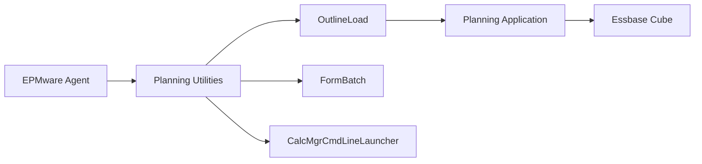

# Hyperion Planning Integration

This section covers the configuration and integration of the EPMware Agent with Oracle Hyperion Planning applications.

## Overview

Hyperion Planning integration enables EPMware to:
- Import metadata from Planning applications
- Deploy dimension changes
- Manage hierarchies
- Update member properties
- Synchronize with Essbase outlines

## Integration Components

<div class="grid cards" markdown>

- :material-lock: **[Password Encryption](password-encryption.md)**  
  Generate and manage encrypted password files
  
- :material-cog: **[Application Properties](properties.md)**  
  Configure Planning-specific settings

</div>

## Planning Architecture



## Prerequisites

### Software Requirements

| Component | Version | Location |
|-----------|---------|----------|
| Planning | 11.1.2.4+ | Application server |
| Java | 1.8+ | System PATH |
| Planning Utilities | Matching Planning version | `$EPM_ORACLE_HOME/products/Planning/bin` |

### User Requirements

The Planning user account needs:
- Planning Administrator role
- Dimension Editor privileges
- Business Rule Administrator (if managing rules)
- Essbase Application Manager access

## Quick Setup Guide

### Step 1: Verify Planning Installation

```bash
# Check Planning utilities
ls $EPM_ORACLE_HOME/products/Planning/bin/

# Key utilities needed:
# - OutlineLoad.sh/cmd
# - PasswordEncryption.sh/cmd
# - FormBatch.sh/cmd
```

### Step 2: Generate Encrypted Password

```bash
cd $EPM_ORACLE_HOME/products/Planning/bin
./PasswordEncryption.sh /path/to/password_file.txt

# Enter password when prompted
# File will be created with encrypted password
```

### Step 3: Configure EPMware

1. Navigate to **Configuration** → **Applications**
2. Select Planning application
3. Add password file path:
   ```
   PASSWORD_FILE=/path/to/password_file.txt
   ```

### Step 4: Test Connection

```bash
# Test with OutlineLoad
./OutlineLoad.sh -f:password_file.txt /A:AppName /U:admin /I:test.csv /D:Entity /L
```

## Configuration in EPMware

### Application Settings

Configure these settings in EPMware for Planning:

| Parameter | Description | Example |
|-----------|-------------|---------|
| **Application Name** | Planning application name | PLANAPP |
| **Server** | Planning server hostname | planning.company.com |
| **Port** | RMI Registry port | 11333 |
| **User** | Planning admin user | admin |
| **Password File** | Encrypted password file path | /opt/oracle/pwd.txt |
| **Essbase Server** | Associated Essbase server | essbase.company.com |
| **Essbase Application** | Essbase app name | PLANAPP |

### Agent Configuration

Add to `agent.properties`:

```properties
# Planning configuration
planning.enabled=true
planning.server=planning.company.com
planning.port=11333
planning.timeout=3600

# Utility paths
planning.outlineload.path=/opt/Oracle/products/Planning/bin/OutlineLoad.sh
planning.formbatch.path=/opt/Oracle/products/Planning/bin/FormBatch.sh

# Deployment options
planning.deployment.backup=true
planning.deployment.validate=true
planning.deployment.refreshDatabase=true
```

## Deployment Operations

### Metadata Import

EPMware can import metadata from Planning:

```bash
# Import dimension members
./OutlineLoad.sh -f:password_file.txt /A:AppName /U:admin /E:Entity.csv /D:Entity

# Import with parent-child format
./OutlineLoad.sh -f:password_file.txt /A:AppName /U:admin /I:hierarchy.csv
```

### Metadata Export

Deploy metadata changes to Planning:

```bash
# Deploy dimension updates
./OutlineLoad.sh -f:password_file.txt /A:AppName /U:admin /I:updates.csv /D:Account /L

# Options:
# /L - Load mode
# /A:AppName - Application name
# /D:Dimension - Target dimension
# /R - Replace mode
```

### Supported Operations

| Operation | Command | Description |
|-----------|---------|-------------|
| Load Members | `/L` | Add new members |
| Replace Dimension | `/R` | Replace entire dimension |
| Update Properties | `/M` | Modify member properties |
| Delete Members | `/D` | Remove members |
| Build Hierarchies | `/H` | Create parent-child relationships |

## Integration with Essbase

Planning dimensions sync with Essbase:

### Refresh Database

```bash
# Refresh Essbase outline after Planning changes
./OutlineLoad.sh -f:password_file.txt /A:AppName /U:admin /RD

# Refresh specific cube
./OutlineLoad.sh -f:password_file.txt /A:AppName /U:admin /RC:CubeName
```

### Database Options

```properties
# Essbase refresh options
planning.essbase.refresh=true
planning.essbase.restructure=true
planning.essbase.clearData=false
planning.essbase.runCalc=true
```

## Form and Business Rule Management

### Form Management

```bash
# Export forms
./FormBatch.sh -f:password_file.txt /A:AppName /U:admin /E:forms.xml

# Import forms
./FormBatch.sh -f:password_file.txt /A:AppName /U:admin /I:forms.xml
```

### Business Rule Deployment

```bash
# Deploy business rules
./CalcMgrCmdLineLauncher.sh -f:password_file.txt /A:AppName /U:admin /D:deploy
```

## Security Configuration

### User Provisioning

Required Planning roles:
```
- Administrator
- Power User (minimum for metadata operations)
- Interactive User (read-only)
```

### Password File Security

```bash
# Secure password file
chmod 600 password_file.txt
chown planning_user:planning_group password_file.txt

# Store in secure location
mkdir -p /opt/secure/planning
mv password_file.txt /opt/secure/planning/
```

## Performance Optimization

### Batch Processing

```properties
# Batch configuration
planning.batch.enabled=true
planning.batch.size=1000
planning.batch.commitInterval=5000
```

### Connection Pooling

```properties
# Connection pool settings
planning.pool.enabled=true
planning.pool.minSize=1
planning.pool.maxSize=5
planning.pool.timeout=30000
```

### Memory Settings

```bash
# Set heap size for OutlineLoad
export EPM_ORACLE_HOME=/opt/Oracle/Middleware/EPMSystem11R1
export JAVA_OPTIONS="-Xms2048m -Xmx4096m"
```

## Troubleshooting

### Common Issues

| Issue | Cause | Solution |
|-------|-------|----------|
| OutlineLoad fails | Invalid password file | Regenerate password file |
| Connection timeout | Network/firewall | Check port 11333 |
| Permission denied | Insufficient privileges | Grant Planning Administrator role |
| Essbase not refreshing | Sync disabled | Enable database refresh |

### Debug Mode

Enable debug logging:

```bash
# Set debug environment
export ODL_LOG_LEVEL=TRACE
export EPM_ORACLE_HOME_LOG_LEVEL=TRACE

# Run with debug
./OutlineLoad.sh -debug -f:password_file.txt /A:AppName /U:admin /L
```

### Log Files

Check these logs for issues:

```bash
# Planning logs
$EPM_ORACLE_INSTANCE/diagnostics/logs/Planning/planning_0.log

# OutlineLoad logs
$EPM_ORACLE_INSTANCE/diagnostics/logs/Planning/outlineload.log

# Agent logs
tail -f /home/epmware/logs/agent.log | grep -i planning
```

## Best Practices

### Deployment Strategy

1. **Test First** - Always test in non-production
2. **Backup** - Create backups before deployment
3. **Validate** - Use validation mode first
4. **Incremental** - Deploy changes incrementally
5. **Off-Hours** - Schedule during maintenance windows

### Metadata Standards

1. **Naming Conventions** - Consistent member naming
2. **Alias Management** - Maintain unique aliases
3. **Property Standards** - Standardize UDAs and attributes
4. **Hierarchy Rules** - Define parent-child rules
5. **Documentation** - Document all customizations

### Security Guidelines

1. **Rotate Passwords** - Regular password changes
2. **Encrypt Files** - Always use encrypted passwords
3. **Audit Access** - Log all operations
4. **Restrict Permissions** - Minimum required access
5. **Monitor Activity** - Track deployment activities

## Monitoring

### Health Checks

```bash
#!/bin/bash
# check_planning.sh

# Check Planning process
ps aux | grep -i planning

# Test connection
timeout 10 $PLANNING_HOME/bin/OutlineLoad.sh -f:pwd.txt /A:App /U:admin /V

# Check port
nc -zv planning-server 11333
```

### Deployment Metrics

Track these metrics:
- Deployment duration
- Success rate
- Error frequency
- Database refresh time
- Member count changes

## Integration Checklist

Before going to production:

- [ ] Planning utilities accessible
- [ ] Password file generated and secured
- [ ] User has required permissions
- [ ] Network connectivity verified
- [ ] Test deployment successful
- [ ] Essbase refresh configured
- [ ] Backup procedures in place
- [ ] Monitoring configured
- [ ] Documentation updated
- [ ] Rollback plan prepared

## Sample Configuration Files

### OutlineLoad Configuration

```ini
# outlineload.properties
Application=PLANAPP
User=admin
PasswordFile=/opt/secure/pwd.txt
Delimiter=,
LoadMethod=/L
RefreshDatabase=true
LogLevel=INFO
```

### Dimension Load File Format

```csv
Parent,Member,Alias,DataStorage,TwoPassCalc,Description
Entity,E1000,North America,StoreData,,North America Region
E1000,E1100,United States,StoreData,,USA Operations
E1000,E1200,Canada,StoreData,,Canadian Operations
```

## Next Steps

- [Password Encryption](password-encryption.md) - Set up password files
- [Application Properties](properties.md) - Configure Planning settings
- [HFM Integration](../hfm/index.md) - Configure HFM if needed
- [Cloud EPM](../cloud/index.md) - Cloud application setup

!!! tip "Version Compatibility"
    Always ensure your Planning utilities version matches your Planning application version to avoid compatibility issues.

!!! warning "Production Deployments"
    Never test new configurations directly in production. Always validate in a development or test environment first.