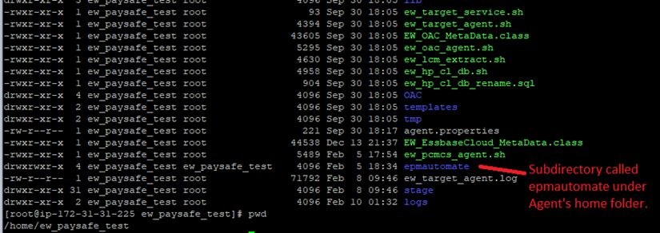
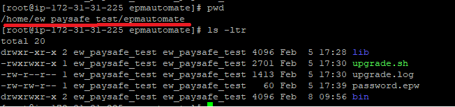

# On-premise Server Option Requirements

**EPM Automate** - EPM Automate enables users to remotely perform tasks within Oracle
Enterprise Performance Management Cloud environments. EPM Automate is required for
the on-premise option.


**To install EPM Automate on Windows:**

By default, EPM Automate is installed in `C:/Oracle/EPM Automate`.

1. From the Windows computer where you want to install EPM Automate, access an environment.
2. On the Home page, access Setting and Actions by clicking your user name.
3. Click Downloads.
4. In the Downloads page, click Download for Windows in the EPM Automate section.
5. Save the installer to your computer.
6. Right-click the installer (EPM Automate.exe), and select Run as administrator.
7. In User Account Control, click Yes.
8. Follow on-screen prompts to complete the installation.


**To install EPM Automate on Linux:**


EPM Automate requires access to a deployment of JRE version 1.7 or higher. The
environment variable *JAVA_HOME* must be set to point to your JRE installation.


1. Access an environment.
2. On the Home page, access Setting and Actions by clicking your user name.
3. Click Downloads.
4. In the Downloads page, click Download for Linux/Mac in the EPM Automate
section.
5. Save the installer (`EPMAutomate.tar`) in a directory in which you have *read/write/execute* privileges.
6. Extract the contents of the installer, set the required environment variables and execute `epmautomate.sh`:

**Linux example (Bash shell assumed) to install and run from your home directory.**<br/>
**JDK version 1.8.0_191 is assumed.**


```
cd ~/
tar xf path_to_downloaded_EPMAutomate.tar
export JAVA_HOME=/opt/jdk1.8.0_191
export PATH ~/Downloads/epmautomate/bin:$PATH
epmautomate.sh

```

!!! info "Note"

    Oracle Enterprise Performance Management Cloud uses Transport Layer Security (TLS) with SHA-2/SHA-256 Cryptographic Hash Algorithm to secure communication with EPM Automate. 
    
    
## **Configure EPM Automate on Agent Server**
    
Create a subdirectory called `“epmautomate”` as shown below under the Agent’s home directory. <br/>
For example, in this case the agent's home directory is `“home/ew_paysafe_test”`.

<br/> 


The directory contents of the EPMAUTOMATE utility should look like the following:

<br/> 

**Tasks performed by the Agent**

The EPMware Agent will communicate with the EPMware application and check every 30
seconds to see if there are any deployments in the queue. Any pending deployments will
be processed and return a status and log details back to the EPMware application. The
EPMware Agent will use the EPM Automate utility to deploy metadata to the PCMCS application.
Therefore, the EPM Automate utility will need to be pre-installed at a specific location as mentioned below.

**Agent Maintenance**

There are two types of updates that may be periodically needed for the EPMware agent.

1. The EPMware agent is updated. In this case EPMware will communicate this in the monthly release email.
2. Oracle updates the EPM Automate utility. The client will need to update the EPMAUTOMATE utility in their environment. 
   The utility can be easily updated by issuing the `“epmautomate upgrade”` command.
   
   
**Test connectivity to PCMCS application using EPM Automate**

Perform the following steps after installing the EPM Aautomate utility under the EPMware
agent directory to ensure EPM Automate is able to connect to the PCMCS application
successfully.

Navigate to `epmautomate/bin` folder and issue command as shown below :

`./epmautomate login <PCMCS_username> <password> <PCMCS App URL>`
 
**For example:**

`./epmautomate login svc_ew_user welcome123 https://pcmcs-testa123456.epm.em3.oraclecloud.com`

The Command should provide a “Login successful” message back to the prompt.

If the EPM Automate utility needs an upgrade then it will show the following message:

**Note: If a new version of EPM Automate is available. You can use "upgrade" command to install.**


## **Upgrade EPMAUTOMATE utility**

EPM Automate utility can easily be upgraded using two commands as shown below. For
more details, please refer to Oracle’s standard documentation.

```

./epmautomate login svc_ew_user welcome123 https://pcmcs-testa123456.epm.em3.oraclecloud.com
./epmautomate.sh upgrade

```
