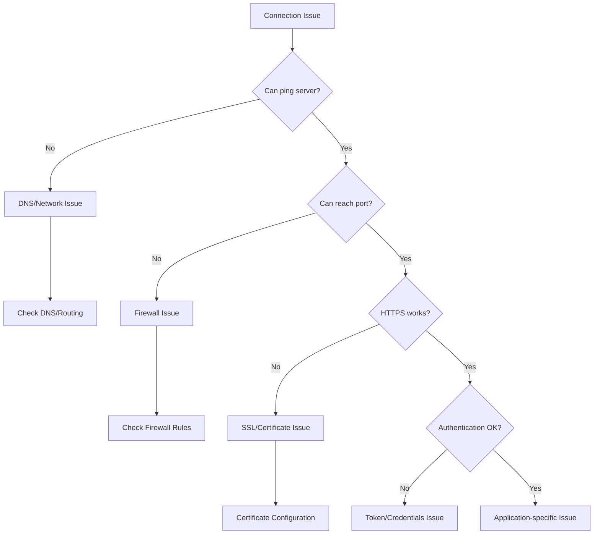

# Connection Problems

This guide helps diagnose and resolve network connectivity issues between the EPMware Agent and EPMware server or target applications.

## Connection Diagnostic Flow



## Network Connectivity Issues

### Issue: Cannot Reach EPMware Server

**Error Messages:**
```
java.net.UnknownHostException: epmware-server.com
java.net.NoRouteToHostException: No route to host
Connection refused: connect
```

**Diagnosis:**

1. **Test basic connectivity:**
```bash
# Ping test
ping epmware-server.com

# If ping is blocked, try DNS lookup
nslookup epmware-server.com
host epmware-server.com

# Check routing
traceroute epmware-server.com  # Linux
tracert epmware-server.com      # Windows
```

2. **Check DNS resolution:**
```bash
# Test DNS servers
dig epmware-server.com
dig @8.8.8.8 epmware-server.com  # Test with Google DNS

# Check /etc/hosts (Linux) or C:\Windows\System32\drivers\etc\hosts
cat /etc/hosts | grep epmware
```

3. **Verify network interface:**
```bash
# Linux
ip addr show
ifconfig

# Windows
ipconfig /all
```

**Solutions:**

1. **DNS Issues:**
```bash
# Add to /etc/hosts as temporary fix
echo "192.168.1.100 epmware-server.com" >> /etc/hosts

# Or fix DNS configuration
# Linux
echo "nameserver 8.8.8.8" >> /etc/resolv.conf

# Windows
netsh interface ip set dns "Local Area Connection" static 8.8.8.8
```

2. **Routing Issues:**
```bash
# Add route if needed (Linux)
sudo ip route add 192.168.1.0/24 via 192.168.0.1

# Windows
route add 192.168.1.0 mask 255.255.255.0 192.168.0.1
```

---

### Issue: Port Connection Failures

**Error Messages:**
```
java.net.ConnectException: Connection timed out
java.net.SocketTimeoutException: connect timed out
Unable to connect to port 443
```

**Diagnosis:**

1. **Test port connectivity:**
```bash
# Using telnet
telnet epmware-server.com 443

# Using nc (netcat)
nc -zv epmware-server.com 443

# Using curl
curl -v telnet://epmware-server.com:443

# PowerShell (Windows)
Test-NetConnection -ComputerName epmware-server.com -Port 443
```

2. **Check local firewall:**
```bash
# Linux iptables
sudo iptables -L -n | grep 443
sudo iptables -L OUTPUT -n -v

# Linux firewalld
sudo firewall-cmd --list-all

# Windows
netsh advfirewall firewall show rule name=all | find "443"
```

3. **Check for port conflicts:**
```bash
# See what's using the port
netstat -an | grep 443
lsof -i :443  # Linux
```

**Solutions:**

1. **Open firewall ports:**

**Linux (iptables):**
```bash
# Allow outbound HTTPS
sudo iptables -A OUTPUT -p tcp --dport 443 -j ACCEPT
sudo iptables -A INPUT -p tcp --sport 443 -m state --state ESTABLISHED -j ACCEPT

# Save rules
sudo iptables-save > /etc/iptables/rules.v4
```

**Linux (firewalld):**
```bash
sudo firewall-cmd --zone=public --add-port=443/tcp --permanent
sudo firewall-cmd --reload
```

**Windows:**
```powershell
# Create outbound rule
New-NetFirewallRule -DisplayName "EPMware HTTPS Out" `
    -Direction Outbound -Protocol TCP -RemotePort 443 `
    -Action Allow

# Create inbound rule for responses
New-NetFirewallRule -DisplayName "EPMware HTTPS In" `
    -Direction Inbound -Protocol TCP -LocalPort 443 `
    -Action Allow
```

2. **Configure for non-standard ports:**
```properties
# If EPMware uses non-standard port
ew.portal.url=https://epmware-server.com:8443
```

---

## Proxy Configuration Issues

### Issue: Cannot Connect Through Proxy

**Error Messages:**
```
java.net.SocketException: Connection reset
ProxyAuthenticationRequired
Unable to tunnel through proxy
HTTP/1.1 407 Proxy Authentication Required
```

**Diagnosis:**

1. **Test proxy connectivity:**
```bash
# Test with curl
curl -x proxy.company.com:8080 https://epmware-server.com

# With authentication
curl -x proxy.company.com:8080 -U username:password https://epmware-server.com

# Environment variables
echo $HTTP_PROXY
echo $HTTPS_PROXY
```

2. **Check proxy settings:**
```bash
# Java system properties
java -Dhttp.proxyHost=proxy.company.com \
     -Dhttp.proxyPort=8080 \
     -Dhttps.proxyHost=proxy.company.com \
     -Dhttps.proxyPort=8080 \
     -jar epmware-agent.jar --test
```

**Solutions:**

1. **Configure proxy in agent.properties:**
```properties
# Basic proxy configuration
http.proxyHost=proxy.company.com
http.proxyPort=8080
https.proxyHost=proxy.company.com
https.proxyPort=8080

# With authentication
http.proxyUser=your_username
http.proxyPassword=your_password

# Non-proxy hosts
http.nonProxyHosts=localhost|127.0.0.1|*.internal.com
```

2. **Set environment variables:**
```bash
# Linux/Unix
export HTTP_PROXY=http://proxy.company.com:8080
export HTTPS_PROXY=http://proxy.company.com:8080
export NO_PROXY=localhost,127.0.0.1,internal.com

# Windows
set HTTP_PROXY=http://proxy.company.com:8080
set HTTPS_PROXY=http://proxy.company.com:8080
set NO_PROXY=localhost,127.0.0.1,internal.com
```

3. **Configure Java system properties:**
```bash
# In ew_target_service.sh
JAVA_OPTS="-Dhttp.proxyHost=proxy.company.com"
JAVA_OPTS="$JAVA_OPTS -Dhttp.proxyPort=8080"
JAVA_OPTS="$JAVA_OPTS -Dhttps.proxyHost=proxy.company.com"
JAVA_OPTS="$JAVA_OPTS -Dhttps.proxyPort=8080"
JAVA_OPTS="$JAVA_OPTS -Dhttp.proxyUser=username"
JAVA_OPTS="$JAVA_OPTS -Dhttp.proxyPassword=password"

java $JAVA_OPTS -jar epmware-agent.jar --spring.config.name=agent
```

---

## SSL/TLS Certificate Issues

### Issue: Certificate Validation Failures

**Error Messages:**
```
javax.net.ssl.SSLHandshakeException: sun.security.validator.ValidatorException
PKIX path building failed
unable to find valid certification path to requested target
Certificate verify failed
```

**Diagnosis:**

1. **Check certificate:**
```bash
# View server certificate
openssl s_client -connect epmware-server.com:443 -showcerts

# Save certificate
echo | openssl s_client -connect epmware-server.com:443 2>/dev/null | \
    openssl x509 -out epmware.crt

# Verify certificate
openssl x509 -in epmware.crt -text -noout
```

2. **Check Java truststore:**
```bash
# List certificates in Java truststore
keytool -list -keystore $JAVA_HOME/lib/security/cacerts -storepass changeit

# Check for specific certificate
keytool -list -keystore $JAVA_HOME/lib/security/cacerts -storepass changeit | \
    grep epmware
```

**Solutions:**

1. **Import certificate to Java truststore:**
```bash
# Download certificate
openssl s_client -connect epmware-server.com:443 </dev/null | \
    openssl x509 -outform PEM > epmware.crt

# Import to Java truststore
keytool -import -trustcacerts -keystore $JAVA_HOME/lib/security/cacerts \
    -storepass changeit -alias epmware -file epmware.crt

# Verify import
keytool -list -keystore $JAVA_HOME/lib/security/cacerts -storepass changeit \
    -alias epmware
```

2. **Use custom truststore:**
```bash
# Create custom truststore
keytool -import -file epmware.crt -alias epmware \
    -keystore custom-truststore.jks -storepass mypassword

# Use custom truststore
JAVA_OPTS="-Djavax.net.ssl.trustStore=/path/to/custom-truststore.jks"
JAVA_OPTS="$JAVA_OPTS -Djavax.net.ssl.trustStorePassword=mypassword"

java $JAVA_OPTS -jar epmware-agent.jar --spring.config.name=agent
```

3. **Disable certificate validation (NOT for production):**
```bash
# Temporary for testing only
java -Dcom.sun.net.ssl.checkRevocation=false \
     -Dtrust.all.certificates=true \
     -jar epmware-agent.jar --test
```

---

## Timeout Issues

### Issue: Connection Timeouts

**Error Messages:**
```
java.net.SocketTimeoutException: Read timed out
Connection timeout after 30000ms
Request timeout after waiting for 30000ms
```

**Diagnosis:**

1. **Test response time:**
```bash
# Measure connection time
time curl -I https://epmware-server.com

# Test with different timeouts
curl --connect-timeout 60 --max-time 120 https://epmware-server.com

# Ping latency
ping -c 10 epmware-server.com | tail -1
```

2. **Check network latency:**
```bash
# Traceroute with timing
traceroute -n epmware-server.com

# MTR for continuous monitoring (Linux)
mtr epmware-server.com
```

**Solutions:**

1. **Increase timeout values:**
```properties
# In agent.properties
agent.connection.timeout=60000  # 60 seconds
agent.read.timeout=60000
agent.write.timeout=60000
agent.socket.timeout=60000
```

2. **Configure Java timeouts:**
```bash
# System properties
JAVA_OPTS="-Dsun.net.client.defaultConnectTimeout=60000"
JAVA_OPTS="$JAVA_OPTS -Dsun.net.client.defaultReadTimeout=60000"
```

3. **Optimize network path:**
```bash
# Increase TCP buffer sizes (Linux)
sudo sysctl -w net.core.rmem_max=134217728
sudo sysctl -w net.core.wmem_max=134217728
sudo sysctl -w net.ipv4.tcp_rmem="4096 87380 134217728"
sudo sysctl -w net.ipv4.tcp_wmem="4096 65536 134217728"
```

---

## Authentication Issues

### Issue: 401 Unauthorized

**Error Messages:**
```
HTTP 401 Unauthorized
Authentication failed: Invalid token
Access denied: Invalid credentials
```

**Diagnosis:**

1. **Test token/credentials:**
```bash
# Test with curl
curl -H "Authorization: Bearer YOUR-TOKEN-HERE" \
     https://epmware-server.com/api/v1/health

# Verbose output
curl -v -H "Authorization: Bearer YOUR-TOKEN-HERE" \
     https://epmware-server.com/api/v1/health
```

2. **Verify token format:**
```bash
# Check token in config
grep ew.portal.token agent.properties

# Token should be 36 characters, UUID format
echo "YOUR-TOKEN" | wc -c  # Should be 37 (36 + newline)
```

**Solutions:**

1. **Regenerate token:**
   - Log into EPMware
   - Navigate to Users
   - Generate new token
   - Update agent.properties

2. **Fix token formatting:**
```bash
# Remove any extra spaces or characters
sed -i 's/ew.portal.token=.*/ew.portal.token=YOUR-NEW-TOKEN/' agent.properties

# Ensure no trailing spaces
sed -i 's/[[:space:]]*$//' agent.properties
```

---

## Load Balancer Issues

### Issue: Intermittent Connection Failures

**Symptoms:**
- Connections work sometimes
- Different responses from same requests
- Session/authentication issues

**Diagnosis:**

```bash
# Check for multiple IPs
nslookup epmware-server.com

# Test each IP directly
for ip in 192.168.1.10 192.168.1.11; do
    curl -I http://$ip
done

# Check for sticky sessions
curl -c cookies.txt -b cookies.txt https://epmware-server.com/api/test
```

**Solutions:**

1. **Configure for load balancer:**
```properties
# Use sticky sessions
agent.http.cookie.enabled=true
agent.http.cookie.store=true

# Longer keep-alive
agent.http.keepalive=true
agent.http.keepalive.timeout=300000
```

2. **Use specific server:**
```properties
# Bypass load balancer if possible
ew.portal.url=https://epmware-node1.com:8080
```

---

## Connection Pool Issues

### Issue: Connection Pool Exhausted

**Error Messages:**
```
Connection pool exhausted
Unable to acquire connection from pool
Timeout waiting for connection from pool
```

**Solutions:**

1. **Increase pool size:**
```properties
# Connection pool settings
connection.pool.max.total=50
connection.pool.max.per.route=10
connection.pool.timeout=30000
```

2. **Configure pool management:**
```properties
# Pool maintenance
connection.pool.validate.after.inactivity=5000
connection.pool.evict.idle.timeout=60000
connection.pool.time.to.live=300000
```

---

## Network Diagnostic Scripts

### Comprehensive Network Test

```bash
#!/bin/bash
# network_diagnostic.sh

SERVER="epmware-server.com"
PORT="443"

echo "=== Network Diagnostics for $SERVER:$PORT ==="

# DNS Resolution
echo -e "\n--- DNS Resolution ---"
nslookup $SERVER
dig +short $SERVER

# Ping Test
echo -e "\n--- Ping Test ---"
ping -c 4 $SERVER

# Port Connectivity
echo -e "\n--- Port Connectivity ---"
nc -zv $SERVER $PORT 2>&1
timeout 5 bash -c "cat < /dev/null > /dev/tcp/$SERVER/$PORT" && \
    echo "Port $PORT is open" || echo "Port $PORT is closed"

# Traceroute
echo -e "\n--- Traceroute ---"
traceroute -n -m 15 $SERVER

# SSL Certificate
echo -e "\n--- SSL Certificate ---"
echo | openssl s_client -connect $SERVER:$PORT 2>/dev/null | \
    openssl x509 -noout -dates

# HTTP Test
echo -e "\n--- HTTP Test ---"
curl -I https://$SERVER

echo -e "\n=== Diagnostics Complete ==="
```

### Connection Monitor

```bash
#!/bin/bash
# monitor_connection.sh

while true; do
    timestamp=$(date '+%Y-%m-%d %H:%M:%S')
    
    # Test connection
    if curl -s -o /dev/null -w "%{http_code}" https://epmware-server.com | \
       grep -q "200"; then
        echo "$timestamp: Connection OK"
    else
        echo "$timestamp: Connection FAILED"
        
        # Additional diagnostics on failure
        ping -c 1 epmware-server.com > /dev/null 2>&1 || \
            echo "$timestamp: Ping failed"
        
        nc -zv epmware-server.com 443 > /dev/null 2>&1 || \
            echo "$timestamp: Port 443 unreachable"
    fi
    
    sleep 30
done
```

## Best Practices for Connection Stability

### Network Configuration

1. **Use static IPs when possible** - Avoid DNS issues
2. **Configure redundant DNS servers** - Prevent DNS failures
3. **Set appropriate timeouts** - Balance between reliability and performance
4. **Monitor network metrics** - Track latency and packet loss

### Security Configuration

1. **Keep certificates updated** - Prevent expiration issues
2. **Use strong cipher suites** - Ensure compatibility
3. **Rotate tokens regularly** - Maintain security
4. **Document firewall rules** - Track what's allowed

### Troubleshooting Approach

1. **Start with basics** - Ping, DNS, port checks
2. **Work up the stack** - Network → Transport → Application
3. **Use verbose logging** - Enable debug for details
4. **Test incrementally** - Isolate each component
5. **Document findings** - Record what works

!!! tip "Connection Testing Order"
    Always test connectivity in this order: DNS resolution → Network routing → Port accessibility → SSL/TLS → Authentication → Application

!!! warning "Security Considerations"
    Never disable certificate validation or use weak ciphers in production. These should only be used temporarily for troubleshooting.

## Next Steps

- [Common Issues](common-issues.md) - General troubleshooting
- [Password Issues](passwords.md) - Authentication problems
- [Service Errors](service-errors.md) - Service-related issues
- [Debug Mode](debug.md) - Enable detailed logging for connection issues