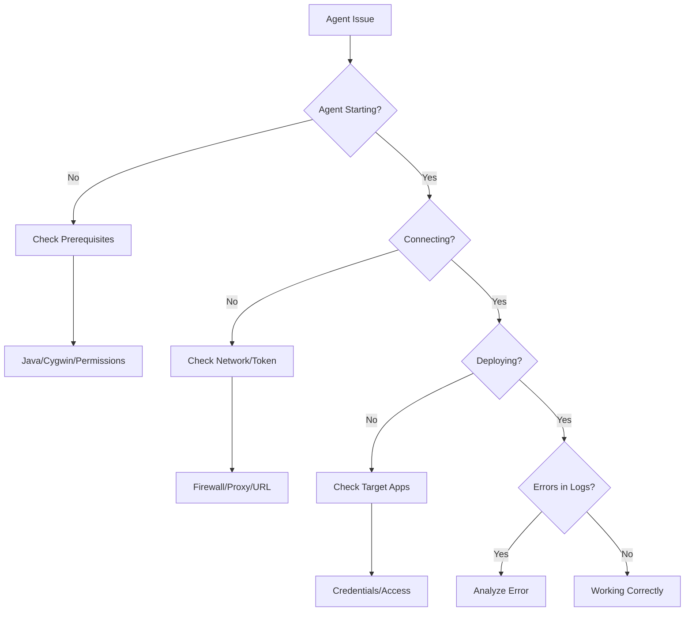

# Troubleshooting Guide

This comprehensive troubleshooting guide helps you diagnose and resolve common issues with the EPMware Agent installation, configuration, and operation.

## Troubleshooting Categories

<div class="grid cards" markdown>

- :material-alert-circle: **[Common Issues](common-issues.md)**  
  Frequently encountered problems and solutions
  
- :material-lan-disconnect: **[Connection Problems](connection.md)**  
  Network and connectivity troubleshooting
  
- :material-lock: **[Password Issues](passwords.md)**  
  Authentication and credential problems
  
- :material-cog-off: **[Service Errors](service-errors.md)**  
  Service startup and runtime errors
  
- :material-bug: **[Debug Mode](debug.md)**  
  Enabling detailed logging and debugging

</div>

## Quick Troubleshooting Flowchart



## Common Symptoms and Solutions

### Agent Won't Start

**Symptoms:**
- No process running
- Scheduled task fails
- Service won't start

**Quick Checks:**
```bash
# Check Java
java -version

# Check configuration file
ls -la agent.properties

# Check script permissions
ls -la ew_target_service.sh

# Check logs for errors
tail -50 logs/agent.log
```

**Common Solutions:**
1. Verify Java installation and PATH
2. Check file permissions
3. Validate configuration syntax
4. Review error messages in logs

### Agent Starts But Stops

**Symptoms:**
- Process starts then exits
- Scheduled task shows "Last run failed"
- No polling in logs

**Quick Checks:**
```bash
# Check last error
grep ERROR logs/agent.log | tail -10

# Check configuration
grep -E "^[^#]" agent.properties

# Test connectivity
curl -I https://your-epmware-server.com
```

**Common Solutions:**
1. Fix configuration errors
2. Regenerate REST token
3. Verify network connectivity
4. Check disk space

### Connection Failures

**Symptoms:**
- "Connection refused" errors
- "Timeout" messages
- "401 Unauthorized" responses

**Quick Checks:**
```bash
# Test network connectivity
ping epmware-server.com
telnet epmware-server.com 443

# Check token
grep ew.portal.token agent.properties

# Test with curl
curl -H "Authorization: Bearer YOUR-TOKEN" https://server/api/health
```

**Common Solutions:**
1. Check firewall rules
2. Verify proxy settings
3. Generate new token
4. Confirm server URL

## Diagnostic Commands

### System Information

```bash
# Operating System
uname -a  # Linux/Unix
systeminfo  # Windows

# Java Version
java -version
echo $JAVA_HOME

# Memory Available
free -h  # Linux
wmic OS get TotalVisibleMemorySize  # Windows

# Disk Space
df -h  # Linux
wmic logicaldisk get size,freespace  # Windows
```

### Process Information

```bash
# Check if agent is running
ps aux | grep epmware  # Linux
tasklist | findstr java  # Windows

# Process details
ps -ef | grep java | grep epmware
Get-Process java | Where {$_.CommandLine -like "*epmware*"}  # PowerShell

# Resource usage
top -p $(pgrep -f epmware)  # Linux
```

### Network Diagnostics

```bash
# DNS resolution
nslookup epmware-server.com

# Route to server
traceroute epmware-server.com  # Linux
tracert epmware-server.com  # Windows

# Port connectivity
nc -zv epmware-server.com 443  # Linux
Test-NetConnection server.com -Port 443  # PowerShell

# Active connections
netstat -an | grep ESTABLISHED
```

## Log Analysis

### Key Log Files

| Log File | Purpose | What to Look For |
|----------|---------|------------------|
| `agent.log` | Main activity log | Errors, deployments, connections |
| `agent-poll.log` | Polling activity | Frequency, gaps, timeouts |
| `agent-debug.log` | Debug information | Detailed traces (if enabled) |

### Log Search Commands

```bash
# Find errors
grep -i error logs/agent.log

# Find warnings
grep -i warn logs/agent.log

# Find specific date
grep "2023-11-15" logs/agent.log

# Find deployment activities
grep -i deploy logs/agent.log

# Count error occurrences
grep -c ERROR logs/agent.log

# Show errors with context
grep -B5 -A5 ERROR logs/agent.log
```

### Common Error Patterns

| Error Pattern | Meaning | Solution |
|--------------|---------|----------|
| `Connection refused` | Server not reachable | Check network/firewall |
| `401 Unauthorized` | Invalid token | Regenerate token |
| `OutOfMemoryError` | Insufficient heap | Increase JVM memory |
| `FileNotFoundException` | Missing file | Check paths and permissions |
| `SocketTimeoutException` | Network timeout | Check connectivity/increase timeout |

## Performance Issues

### Slow Polling

**Symptoms:**
- Polling intervals longer than configured
- High CPU usage
- Memory consumption growing

**Diagnostics:**
```bash
# Check polling frequency
tail -f logs/agent-poll.log

# Monitor resource usage
top -p $(pgrep -f epmware)

# Check JVM memory
jmap -heap $(pgrep -f epmware)
```

**Solutions:**
1. Increase JVM heap size
2. Check network latency
3. Review deployment queue size
4. Optimize polling interval

### Memory Issues

**Symptoms:**
- OutOfMemoryError in logs
- Agent crashes
- System becoming unresponsive

**Solutions:**
```bash
# Increase heap size in ew_target_service.sh
JAVA_OPTS="-Xms1024m -Xmx2048m"

# Enable heap dump on OOM
JAVA_OPTS="$JAVA_OPTS -XX:+HeapDumpOnOutOfMemoryError"
JAVA_OPTS="$JAVA_OPTS -XX:HeapDumpPath=/var/log/epmware"
```

## Recovery Procedures

### Emergency Restart

```bash
#!/bin/bash
# emergency_restart.sh

# Force stop all agent processes
pkill -9 -f epmware-agent

# Clean up locks and temp files
rm -f /home/epmadmin/*.lock
rm -f /home/epmadmin/agent.pid
rm -rf /home/epmadmin/temp/*

# Wait for cleanup
sleep 5

# Start fresh
cd /home/epmadmin
./ew_target_service.sh &

echo "Emergency restart completed"
```

### Configuration Recovery

```bash
# Restore from backup
cp agent.properties.backup agent.properties

# Validate configuration
java -jar epmware-agent.jar --validate-config

# Test connection
java -jar epmware-agent.jar --test
```

## Getting Help

### Information to Collect

When requesting support, gather:

1. **System Information**
   ```bash
   uname -a > system_info.txt
   java -version >> system_info.txt
   df -h >> system_info.txt
   free -h >> system_info.txt
   ```

2. **Configuration** (sanitized)
   ```bash
   grep -v token agent.properties > config_sanitized.txt
   ```

3. **Recent Logs**
   ```bash
   tail -1000 logs/agent.log > recent_logs.txt
   grep ERROR logs/agent.log > errors.txt
   ```

4. **Process Information**
   ```bash
   ps aux | grep epmware > process_info.txt
   ```

### Support Channels

- **Email**: support@epmware.com
- **Phone**: 408-614-0442
- **Portal**: support.epmware.com

### Support Ticket Template

```markdown
## Issue Description
[Describe the problem]

## Environment
- Agent Version: 1.7.0
- OS: [Windows/Linux version]
- Java Version: [output of java -version]
- EPMware URL: [your instance]

## Error Messages
[Paste relevant error messages]

## Steps to Reproduce
1. [Step 1]
2. [Step 2]
3. [Step 3]

## What I've Tried
- [Solution attempt 1]
- [Solution attempt 2]

## Attachments
- system_info.txt
- config_sanitized.txt
- recent_logs.txt
```

## Prevention Strategies

### Proactive Monitoring

1. **Set Up Alerts**
   - Process monitoring
   - Log error detection
   - Disk space warnings
   - Memory usage alerts

2. **Regular Health Checks**
   - Daily log review
   - Weekly performance check
   - Monthly configuration audit

3. **Maintenance Schedule**
   - Log rotation
   - Temp file cleanup
   - Configuration backups
   - Software updates

### Best Practices

1. **Documentation**
   - Keep configuration documented
   - Record changes
   - Maintain runbooks

2. **Testing**
   - Test changes in non-production
   - Verify backups work
   - Practice recovery procedures

3. **Updates**
   - Stay current with patches
   - Review release notes
   - Plan upgrade windows

## Quick Reference

### Critical Files and Paths

```bash
# Configuration
agent.properties
ew_target_service.sh

# Logs
logs/agent.log
logs/agent-poll.log

# Temporary files
temp/
*.pid
*.lock

# Backups
*.backup
*.old
```

### Important Commands

```bash
# Start agent
./ew_target_service.sh

# Check status
ps aux | grep epmware

# View logs
tail -f logs/agent.log

# Test connection
java -jar epmware-agent.jar --test

# Kill agent
pkill -f epmware-agent
```

!!! tip "Log Verbosity"
    Increase log verbosity when troubleshooting, but remember to restore normal levels after resolving issues to avoid excessive disk usage.

!!! warning "Production Changes"
    Always test fixes in a non-production environment first. Have a rollback plan before making production changes.

## Next Steps

Based on your issue type, proceed to:

- [Common Issues](common-issues.md) - Frequently seen problems
- [Connection Problems](connection.md) - Network issues
- [Password Issues](passwords.md) - Authentication problems
- [Service Errors](service-errors.md) - Service failures
- [Debug Mode](debug.md) - Detailed debugging